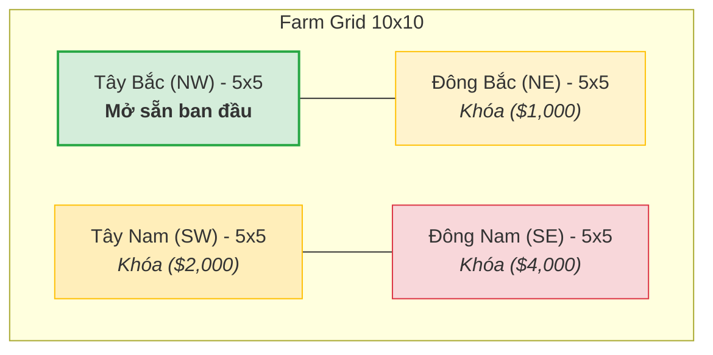
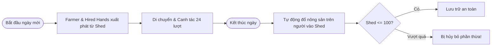
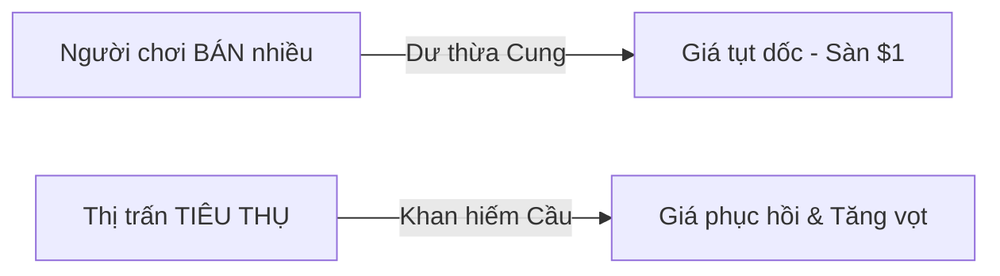
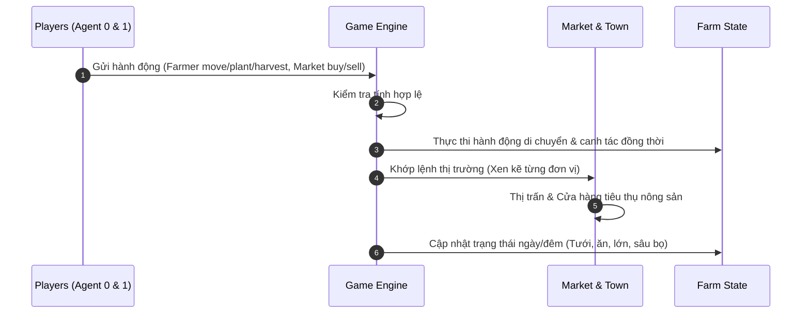

# 🌾 Kaggriculture: Cẩm Nang Toàn Diện & Phân Tích Chiến Thuật

> [!ABSTRACT] **Tóm Tắt Cuộc Thi**
> **Kaggriculture** là cuộc thi AI mô phỏng nông trại đối kháng 2 người chơi (2-Player Competitive Farming Sim). 
> * **Thời lượng trận đấu:** 30 ngày trong game (tương đương **720 lượt hành động** - 24 lượt/ngày).
> * **Điều kiện thắng:** Người chơi sở hữu **nhiều tiền mặt nhất (Coins in Bank)** khi kết thúc ngày thứ 30 sẽ giành chiến thắng. Nông sản chưa bán trong kho sẽ **không** được tính điểm.

---

## 🗺️ 1. Bản Đồ Nông Trại & Cơ Chế Đất Đai

### Phân Bổ Bản Đồ
Bản đồ mỗi người chơi là một lưới **10 × 10 ô** độc lập, được chia thành **4 góc phần tư (Quadrants - 5 × 5 ô)**:



> [!INFO] **Quy Tắc Đất Đai:**
> * Vốn khởi điểm: **$3,000**.
> * Ban đầu chỉ mở góc **NW (25 ô)**.
> * Các ô bị khóa (`LOCKED`) vẫn có thể đi xuyên qua, nhưng **không thể** thực hiện gieo trồng hay xây dựng trên đó.
> * Chi phí mở khóa bằng lệnh `BUY_LAND`:
>   * Mảnh thứ 2: **$1,000**
>   * Mảnh thứ 3: **$2,000**
>   * Mảnh thứ 4: **$4,000**

---

## 🏠 2. Nhà Kho (Shed) & Quản Lý Nhân Lực



* **Vị trí Shed:** Trung tâm bản đồ, tiếp giáp 4 ô tọa độ: `(4,4)`, `(5,4)`, `(4,5)`, `(5,5)`.
* **Sức chứa:** Tối đa **100 sản phẩm** (Trứng, Sữa, Len, Nông sản, Phân bón). Hạt giống có ngăn chứa riêng không giới hạn.
* **Thuê Nhân Công (`HIRE`):**
  * Chi phí tính theo dãy Fibonacci tăng dần trong ngày: `1, 1, 2, 3, 5, 8, 13, 21, ...`
  * Reset chi phí về 1 vào đầu mỗi ngày mới.
  * Nhân công tự động biến mất vào cuối ngày sau khi đã cất nông sản vào kho.

---

## 🌽 3. Hệ Thống Cây Trồng (Crops)

| Cây trồng | Loại thu hoạch | Giá hạt | Giá bán gốc | Ngày bắt đầu thu | Ngày max sản lượng | Chu kỳ lặp | Max Yield | Sản lượng / ô / ngày |
| :--- | :--- | :---: | :---: | :---: | :---: | :---: | :---: | :---: |
| **Wheat (Lúa mì)** | 1 lần | $10 | $25 | Ngày 2 | Ngày 4 | Không | 6 (4 unfert) | **0.80** |
| **Carrot (Cà rốt)** | 1 lần | $20 | $35 | Ngày 2 | Ngày 3 | Không | 4 (3 unfert) | **0.75** |
| **Tomato (Cà chua)** | Nhiều lần | $50 | $60 | Ngày 8 | Ngày 11 | Mỗi ngày × 4 | 4 | **0.33** |
| **Strawberry (Dâu)** | Nhiều lần | $100 | $120 | Ngày 10 | Ngày 16 | Cách ngày × 4 | 4 | **0.24** |
| **Melon (Dưa hấu)** | 1 lần | $80 | $250 | Ngày 10 | Ngày 10 | Không | 6 | **0.55** |

> [!WARNING] **Quy Tắc Tưới Nước & Phân Bón**
> 1. **Tưới Nước (`WATER`):** Cây phải được tưới mỗi ngày. Nếu bị bỏ quên **2 ngày liên tiếp**, cây sẽ chết và hóa thành **Cỏ dại (`WEED`)**.
> 2. **Cửa sổ sản lượng (Bonus Window):** Tưới nước trong giai đoạn từ `ceil(max_yield_day / 2)` đến lúc thu hoạch sẽ cộng thêm sản lượng mỗi ngày.
> 3. **Phân Bón (`FERTILIZE`):** Nhân đôi điểm thưởng sản lượng trong 3 ngày tiếp theo (chỉ tác dụng nếu ngày đó có tưới nước).

---

## 🐄 4. Hệ Thống Động Vật (Livestock)

| Vật nuôi | Chuồng yêu cầu | Giá mua | Sản phẩm | Giá sản phẩm gốc | Chu kỳ sản xuất | Tối đa tích trữ |
| :--- | :--- | :---: | :--- | :---: | :--- | :---: |
| **Goose (Ngỗng)** | `BUILD_COOP` | $300 | 🥚 Egg | $50 | Mỗi ngày (Indefinitely) | 4 |
| **Cow (Bò)** | `BUILD_PASTURE` | $400 | 🥛 Milk | $160 | Mỗi 2 ngày (Indefinitely) | 6 |
| **Sheep (Cừu)** | `BUILD_PASTURE` | $500 | 🧶 Wool | $200 | Mỗi 3 ngày (Indefinitely) | 6 |

> [!IMPORTANT] **Quy Tắc Nuôi & Chăm Sóc Động Vật**
> * **Thức ăn (`FEED`):** Toàn bộ động vật ăn **Wheat (Lúa mì)** hàng ngày. Nếu bỏ đói **2 ngày liên tiếp**, vật nuôi sẽ trốn mất vĩnh viễn.
> * **Vuốt ve/Chăm sóc (`CARE`):** Tích lũy +1 bonus sản lượng cho đợt thu hoạch tiếp theo.
> * **Thu phân bón (`COLLECT_FERTILIZER`):** Mỗi con vật sống sót tạo ra 1 đơn vị phân bón mỗi ngày.

---

## 📈 5. Cơ Chế Thị Trường Động (Dynamic Economy)

Thị trường bắt đầu với kho hàng dự trữ $I_0 = 10,000$ đơn vị cho mỗi mặt hàng. Giá cả biến động theo quy luật hàm phi tuyến:



### Tiêu Thụ Của Thị Trấn (Town Demand)
* **Trung tâm thị trấn:** Tự động tiêu thụ 1 đơn vị mỗi loại nông sản mỗi ngày.
* **Cửa hàng mở mới (Town Shops):** Cứ mỗi **3 ngày** sẽ mở ngẫu nhiên 1 cửa hàng mới (tối đa 8 cửa hàng, có thể trùng lặp):

| Loại Cửa Hàng | Tăng Nhu Cầu Tiêu Thụ Cho |
| :--- | :--- |
| **Bakery** | Trứng (Egg), Lúa mì (Wheat) |
| **Pizza Shop** | Sữa (Milk), Cà chua (Tomato), Lúa mì (Wheat) |
| **Brunch Spot** | Trứng (Egg), Lúa mì (Wheat), Dâu tây (Strawberry) |
| **Yarn Store** | Len (Wool - tiêu thụ 2x) |
| **Pet Cafe** | Cà rốt (Carrot - tiêu thụ 2x) |
| **Ice Cream Shop** | Dâu tây, Sữa, Lúa mì |
| **Smoothie Shop** | Dâu tây, Sữa |
| **Farmers Market** | Lúa mì, Cà rốt, Cà chua, Dâu tây |

---

## 🔄 6. Vòng Đời Mỗi Lượt Chơi (Turn Processing)



---

## 🧠 7. Chiến Thuật Đề Xuất (Strategy Guide)

> [!TIP] **Giai Đoạn Đầu (Day 1 - Day 7): Tích Lũy Vốn Nhanh**
> * Tập trung trồng **Wheat** và **Carrot** vì thời gian quay vòng vốn cực nhanh (2-4 ngày).
> * Giữ đủ lúa mì trong kho để sẵn sàng nuôi động vật.
> * Xây chuồng Ngỗng (`Goose`) sớm để tạo dòng tiền đều đặn từ trứng ($50/ngày) và thu phân bón miễn phí.

> [!TIP] **Giai Đoạn Giữa (Day 8 - Day 22): Mở Rộng & Canh Giá Thị Trường**
> * Mở khóa ô đất thứ 2 ($1,000) khi có từ 2-3 nhân công làm việc.
> * Trồng cây giá trị cao (**Melon**, **Strawberry**) nhưng **không bán tháo ồ ạt** cùng một lúc để tránh làm sập giá thị trường.
> * Quan sát các cửa hàng thị trấn đã mở (`unlocked_shops`) để đầu tư đúng loại nông sản đang có lực mua mạnh.

> [!TIP] **Giai Đoạn Cuối (Day 23 - Day 30): Thanh Lý & Tối Đa Tiền Mặt**
> * **Dừng gieo hạt** cây dài ngày từ sau ngày 20 (Melon cần 10 ngày để chín).
> * Sau ngày 26, chỉ trồng Wheat hoặc Carrot chu kỳ ngắn.
> * Ngày 29 - 30: Thu hoạch toàn bộ, bán sạch nông sản trong kho về $0 trước khi hết 720 turns vì nông sản thừa không được tính điểm.

---

## 🛠️ 8. Bộ Công Cụ & Thao Tác Local

### Cấu Trúc Thư Mục
* [[main.py]]: File code chứa hàm `agent(obs)` để nộp bài.
* [[simulate.py]]: Chạy mô phỏng 720 turns đối đầu với bot starter/random.
* [[README.md]]: Đặc tả kỹ thuật gốc bằng tiếng Anh từ Kaggle.
* [[AGENTS.md]]: Hướng dẫn API & Submissions chi tiết.

### Các Lệnh Thực Thi Tiêu Biểu

```powershell
# 1. Chạy test thử nghiệm Agent tại máy local
python simulate.py

# 2. Nộp bài trực tiếp lên Kaggle
kaggle competitions submit kaggriculture -f main.py -m "Agent v1 - Optimized Wheat & Goose"

# 3. Kiểm tra trạng thái các bài nộp
kaggle competitions submissions kaggriculture

# 4. Xem bảng xếp hạng trực tiếp
kaggle competitions leaderboard kaggriculture --show
```
