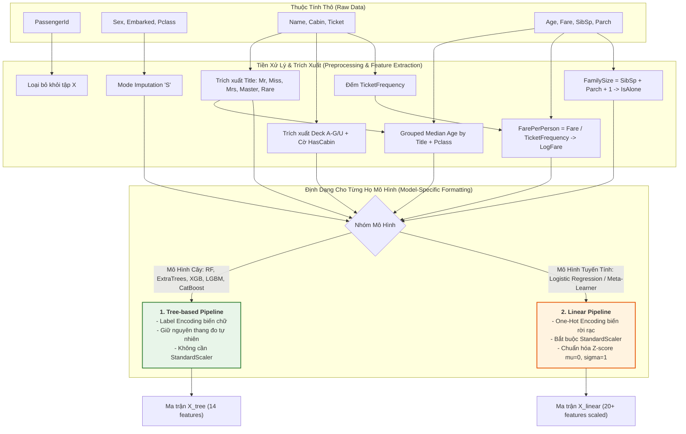

# 📖 Titanic: Từ Điển Dữ Liệu & Hướng Dẫn Tiền Xử Lý

Tài liệu này phân tích chi tiết từng thuộc tính trong bộ dữ liệu [[train.csv]] và [[test.csv]], cùng chiến lược xử lý dữ liệu khuyết thiếu và trích xuất đặc trưng.

---

## 1. Bảng Chi Tiết Thuộc Tính

### `PassengerId`
* **Kiểu:** Số nguyên (1 – 1309).
* **Mô tả:** ID duy nhất của từng hành khách.
* **Xử lý:** Loại bỏ khỏi tập đặc trưng huấn luyện ($X$), dùng để đối chiếu khi xuất file nộp bài (`test['PassengerId']`).

---

### `Survived` (Biến Mục Tiêu - Target)
* **Kiểu:** Nhị phân (0 hoặc 1).
* **Phân phối:**
  * `0` (Thiệt mạng): 549 người (~61.6%)
  * `1` (Sống sót): 342 người (~38.4%)

---

### `Pclass` (Hạng Vé)
* **Kiểu:** Số nguyên thứ tự (1, 2, 3).
* **Ý nghĩa:** Đại diện cho vị trí phòng trên tàu và tầng lớp kinh tế.
* **Tỷ lệ sống:**
  * Hạng 1: **62.96%**
  * Hạng 2: **47.28%**
  * Hạng 3: **24.24%**
* **Xử lý:** Giữ nguyên dạng số (ordinal) hoặc One-Hot Encoding (`Pclass_1`, `Pclass_2`, `Pclass_3`).

---

### `Name` (Họ Tên)
* **Kiểu:** Chuỗi văn bản. Ví dụ: `"Heikkinen, Miss. Laina"`.
* **Trích xuất đặc trưng:**
  * Danh xưng (Title): `Mr`, `Miss`, `Mrs`, `Master`, `Royalty/Officer` (Dr, Rev, Col, Major, Sir, Lady, Countess...).
  * `Master`: Đại diện cho bé trai dưới 14 tuổi $\rightarrow$ tỷ lệ sống rất cao.
  * Họ (Surname): Có thể dùng để gom nhóm gia đình (`Surname + Pclass + Ticket`).

---

### `Sex` (Giới Tính)
* **Kiểu:** Chuỗi phân loại (`male`, `female`).
* **Tỷ lệ sống:**
  * Nữ (`female`): **74.20%**
  * Nam (`male`): **18.89%**
* **Xử lý:** Binary Mapping: `female = 1`, `male = 0`.

---

### `Age` (Độ Tuổi)
* **Kiểu:** Số thực (0.42 – 80.0 tuổi).
* **Dữ liệu khuyết thiếu:** 177 giá trị ở Train (~20%), 86 giá trị ở Test (~21%).
* **Nguồn gốc biến `Title`:** `Title` (Danh xưng) không có sẵn trong dữ liệu gốc mà được **trích xuất từ cột `Name`** (ví dụ: `"Braund, Mr. Owen Harris"` $\rightarrow$ `Mr`, `"Palsson, Master. Gosta"` $\rightarrow$ `Master`). Bước trích xuất `Title` được thực hiện trước khi điền khuyết `Age`.
* **Chiến lược điền khuyết (Imputation):**
  * **Không nên điền Mean/Median chung toàn bộ bảng:** Sẽ làm mất tính phân hóa độ tuổi giữa trẻ em và người lớn (làm một bé trai 2 tuổi bị điền thành 28-29 tuổi).
  * **Điền Median theo nhóm `(Title, Pclass)`:** Nhóm này là tối ưu nhất vì:
    * `Title` **đã chứa sẵn thông tin giới tính `Sex`** (`Mr`, `Master` là Nam 100%; `Miss`, `Mrs` là Nữ 100%) và phân tầng độ tuổi rõ rệt (`Master` $\le 12$ tuổi, `Mr` trưởng thành).
    * `Pclass` đại diện cho thế hệ và tầng lớp xã hội (Hành khách Hạng 1 thường già dặn hơn Hạng 3).
  * **Ví dụ độ tuổi trung vị thực tế theo nhóm:**
    * `(Master, Pclass 1, 2, 3)` $\rightarrow$ **~4 – 5 tuổi** (bé trai).
    * `(Mr, Pclass 1)` $\rightarrow$ **~40 tuổi** (quý ông trung niên).
    * `(Mr, Pclass 3)` $\rightarrow$ **~26 tuổi** (thanh niên lao động).
    * `(Miss, Pclass 1)` $\rightarrow$ **~30 tuổi**; `(Miss, Pclass 3)` $\rightarrow$ **~18 tuổi**.
    * `(Mrs, Pclass 1)` $\rightarrow$ **~40 tuổi**; `(Mrs, Pclass 3)` $\rightarrow$ **~31 tuổi**.

---

### `SibSp` & `Parch` (Mối Quan Hệ Gia Đình)
* **`SibSp`:** Số anh chị em (Siblings) hoặc vợ/chồng (Spouse).
* **`Parch`:** Số cha mẹ (Parents) hoặc con cái (Children).
* **Trích xuất đặc trưng:**
  * $\text{FamilySize} = \text{SibSp} + \text{Parch} + 1$
  * `IsAlone`: 1 nếu $\text{FamilySize} = 1$, ngược lại 0.
  * Phân nhóm gia đình: `Solo` (1), `Small` (2–4), `Large` (>4).

---

### `Ticket` (Mã Số Vé)
* **Kiểu:** Chuỗi chữ và số. Ví dụ: `"PC 17599"`, `"347082"`, `"CA. 2343"`.
* **Trích xuất đặc trưng:**
  * `Ticket_Frequency`: Số lượng người sở hữu cùng một mã vé. Những người đi cùng đoàn thường có cùng số phận.
  * `Ticket_Prefix`: Tiền tố chữ của vé (ví dụ: `PC`, `CA`, `A5`, `None`).

---

### `Fare` (Giá Vé)
* **Kiểu:** Số thực ($0.0 – $512.33).
* **Dữ liệu khuyết thiếu:** 1 giá trị ở Test (hành khách ở Pclass 3). Điền bằng median của Pclass 3 ($7.75).
* **Trích xuất đặc trưng:**
  * $\text{Fare\_Per\_Person} = \frac{\text{Fare}}{\text{Ticket\_Frequency}}$
  * `Log_Fare`: $\ln(1 + \text{Fare})$ để giảm độ lệch (skewness) của dữ liệu giá vé.

---

### `Cabin` (Số Hiệu Khoang Phòng)
* **Kiểu:** Chuỗi. Ví dụ: `"C85"`, `"B96 B98"`.
* **Dữ liệu khuyết thiếu:** ~77% ở Train và ~78% ở Test.
* **Trích xuất đặc trưng:**
  * `Has_Cabin`: 1 nếu có thông tin Cabin, 0 nếu bị khuyết (người có Cabin có tỷ lệ sống cao hơn rõ rệt).
  * `Deck`: Chữ cái đầu tiên đại diện cho boong tàu (`A`, `B`, `C`, `D`, `E`, `F`, `G`, `T` hoặc `U` cho Unknown).

---

### `Embarked` (Cảng Lên Tàu)
* **Kiểu:** Phân loại (`C` = Cherbourg, `Q` = Queenstown, `S` = Southampton).
* **Dữ liệu khuyết thiếu:** 2 giá trị ở Train. Điền bằng mode (`S`).
* **Tỷ lệ sống theo cảng:**
  * `C` (Cherbourg): **55.36%** (Phần lớn là khách VIP / Hạng 1)
  * `Q` (Queenstown): **38.96%**
  * `S` (Southampton): **33.70%**

---

## 2. Quy Trình Tiền Xử Lý Dữ Liệu Cho Các Mô Hình Đề Xuất (Data Preprocessing Pipeline)

---

### 📊 2.1 Bảng Ánh Xạ Biến Đầu Vào (Input-Output Feature Mapping Table)

| Cột Gốc (Raw Feature) | Phương Pháp Tiền Xử Lý & Biến Đổi                                                                                                                                    | Tên Biến Mới (Engineered Feature) |        Kiểu Dữ Liệu        | Áp Dụng Cho Mô Hình Cây (RF, ET, XGB, LGBM, CatBoost) |     Áp Dụng Cho Mô Hình Tuyến Tính (Logistic Regression)     |
| :-------------------- | :------------------------------------------------------------------------------------------------------------------------------------------------------------------- | :-------------------------------- | :------------------------: | :---------------------------------------------------: | :----------------------------------------------------------: |
| `PassengerId`         | Bỏ qua khi train, giữ lại để xuất submission.                                                                                                                        | -                                 |          `int64`           |                       ❌ Loại bỏ                       |                          ❌ Loại bỏ                           |
| `Survived`            | Biến mục tiêu (Target).                                                                                                                                              | `Survived`                        |      `int64` ($0/1$)       |                      Target $y$                       |                          Target $y$                          |
| `Pclass`              | Giữ nguyên thứ tự hạng vé.                                                                                                                                           | `Pclass`                          |    `int64` ($1, 2, 3$)     |               Dạng Ordinal ($1, 2, 3$)                |         One-Hot (`Pclass_1`, `Pclass_2`, `Pclass_3`)         |
| `Name`                | Regex trích xuất danh xưng $\rightarrow$ gom nhóm 5 loại (`Mr`, `Miss`, `Mrs`, `Master`, `Rare`).                                                                    | `Title`                           |     `int64` / `string`     |                Label Encoding ($0..4$)                |                   One-Hot Encoding (5 cột)                   |
| `Sex`                 | Nhị phân hóa giới tính.                                                                                                                                              | `Sex`                             |      `int64` ($0/1$)       |         $0 = \text{male}, 1 = \text{female}$          |             $0 = \text{male}, 1 = \text{female}$             |
| `Age`                 | Điền missing bằng trung vị nhóm `(Title, Pclass)`.                                                                                                                   | `Age`                             |         `float64`          |     Điền median $\rightarrow$ Giữ nguyên số thực      |          Điền median $\rightarrow$ `StandardScaler`          |
| `SibSp`, `Parch`      | Tính tổng số thành viên gia đình đi cùng: $\text{SibSp} + \text{Parch} + 1$.                                                                                         | `FamilySize` `IsAlone`         | `int64` `int64` ($0/1$) |      `FamilySize` ($1..11$) `IsAlone` ($0/1$)      |      `StandardScaler(FamilySize)` `IsAlone` ($0/1$)       |
| `Ticket`              | Đếm số lượng người chung mã vé.                                                                                                                                      | `TicketFrequency`                 |          `int64`           |              Tần suất xuất hiện ($1..7$)              |              `StandardScaler(TicketFrequency)`               |
| `Fare`                | 1. Điền missing bằng median `Pclass = 3` 2. $\text{FarePerPerson} = \text{Fare} / \text{TicketFrequency}$ 3. $\text{LogFare} = \ln(1 + \text{FarePerPerson})$. | `FarePerPerson` `LogFare`      |   `float64` `float64`   |     Giảm độ lệch skewness, phân tách tốt tầng lớp     | Bắt buộc `StandardScaler` (tránh giá trị vé áp đảo trọng số) |
| `Cabin`               | 1. Lấy chữ cái đầu boong tàu (`A` - `G`, `'U'` cho missing) 2. Cờ `HasCabin = (Deck != 'U')`.                                                                     | `Deck` `HasCabin`              | `int64` `int64` ($0/1$) |     Label Encoding (`Deck`) `HasCabin` ($0/1$)     |      One-Hot (`Deck_A`..`Deck_U`) `HasCabin` ($0/1$)      |
| `Embarked`            | Điền missing 2 dòng bằng Mode (`'S'`).                                                                                                                               | `Embarked`                        |     `int64` / `string`     |              Label Encoding (`0, 1, 2`)               |                 One-Hot (`Embarked_C, Q, S`)                 |

---

### ⚙️ 2.2 Quy Chuẩn Tiền Xử Lý Theo Từng Nhóm Mô Hình Đề Xuất

#### 🌲 1. Nhóm Mô Hình Cây (Random Forest, Extra Trees, XGBoost, LightGBM, CatBoost)
* **Mã hóa (Encoding):**
  * Sử dụng **Label Encoding** / **Ordinal Encoding** (`Sex`, `Embarked`, `Title`, `Deck`) $\rightarrow$ giúp giữ số chiều cố định (**14 features**), tránh hiện tượng cây bị phân mảnh dữ liệu (Sparsity) do One-Hot tạo ra quá nhiều cột $0$.
  * Với **CatBoost** và **LightGBM**: Có thể truyền trực tiếp danh sách cột phân loại `categorical_features=['Sex', 'Embarked', 'Title', 'Deck']` để thuật toán tự động tối ưu hóa Target Statistics.
* **Chuẩn hóa thang đo (Scaling):**
  * **Không cần áp dụng `StandardScaler` hay `MinMaxScaler`**. Cây quyết định chia nhánh dựa trên bất đẳng thức so sánh ($x_j \le \theta$), bất biến với mọi phép biến đổi đơn điệu (Monotonic transformations).
* **Xử lý Outliers:**
  * Mô hình cây hoàn toàn miễn nhiễm với giá trị ngoại lai của `Fare` hay `Age`. Tuy nhiên, biến $\text{LogFare} = \ln(1 + \text{FarePerPerson})$ vẫn được khuyến nghị để giúp các mô hình Boosting hội tụ nhanh hơn.

#### 📈 2. Nhóm Mô Hình Tuyến Tính & Meta-Learner (Logistic Regression)
* **Mã hóa (Encoding):**
  * **Bắt buộc dùng One-Hot Encoding** cho tất cả các biến danh nghĩa (`Title`, `Embarked`, `Pclass`, `Deck`). Nếu dùng Label Encoding ($0, 1, 2$), hàm tuyến tính sẽ ngầm hiểu rằng $\text{Hạng 3} = 3 \times \text{Hạng 1}$, gây sai lệch bản chất toán học.
* **Chuẩn hóa thang đo (Scaling):**
  * **Bắt buộc áp dụng `StandardScaler` (Z-score Normalization)** trên toàn bộ các biến số (`Age`, `FarePerPerson`, `LogFare`, `FamilySize`, `TicketFrequency`):
    $$z = \frac{x - \mu}{\sigma}$$
  * *Lý do:* Nếu không chuẩn hóa, biến `Fare` (giá trị từ $0$ đến $>500$) sẽ lấn át hoàn toàn biến `Age` (từ $0$ đến $80$) hoặc `Sex` ($0/1$), khiến gradient descent bị dao động và thành phần điều hòa Regularization phạt sai lệch trọng số.

---

### 🛡️ 2.3 Nguyên Tắc Vàng Chống Rò Rỉ Dữ Liệu (Strict Anti-Leakage Rules)

> [!WARNING] **Tránh Rò Rỉ Dữ Liệu Khi Tiền Xử Lý (No Data Leakage):**
> 1. **Chỉ `fit` trên Train Fold:** Các phép tính thống kê (Median tuổi theo `Title+Pclass`, Median giá vé, Mode cảng lên tàu, Mean/Std của `StandardScaler`, và từ điển mã hóa `LabelEncoder`) **chỉ được học trên tập huấn luyện của Fold đó**.
> 2. **Chỉ `transform` sang Validation Fold và Test Set:** Áp dụng các giá trị đã học được từ Train Fold để điền và biến đổi cho Validation Fold và Test Set, tuyệt đối không dùng toàn bộ dữ liệu Train+Test để tính Mean/Median/Mode trước khi chia Fold.

---

## 🔗 3. Liên Kết Tài Liệu Tham Chiếu
* [[PIPELINE_PLAN.md]]: Kế hoạch lập trình, kiến trúc 5 mô hình và code mẫu Notebook.
* [[OVERVIEW.md]]: Mục tiêu và tiêu chí đánh giá Accuracy.
* [[RULES.md]]: Quy định nộp bài và liêm chính dữ liệu.
* [[README_VI.md]]: Cẩm nang tổng quan.
