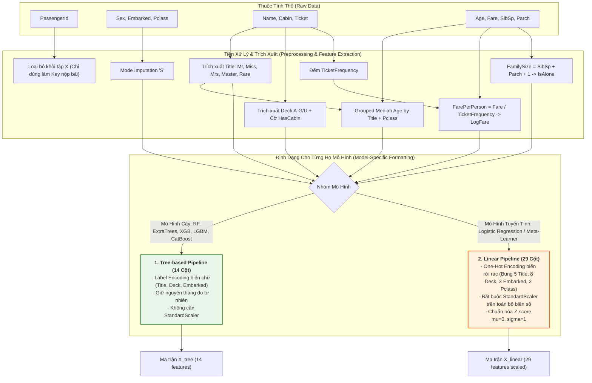
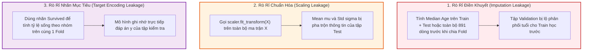

# 📖 Titanic: Từ Điển Dữ Liệu & Hướng Dẫn Tiền Xử Lý

Tài liệu này phân tích chi tiết từng thuộc tính trong bộ dữ liệu [[train.csv]] và [[test.csv]], cùng chiến lược xử lý dữ liệu khuyết thiếu và trích xuất đặc trưng.

---

## 1. Bảng Chi Tiết Thuộc Tính

### `PassengerId`
* **Kiểu:** Số nguyên (1 – 1309).
* **Mô tả:** ID duy nhất của từng hành khách.
* **Xử lý:** Loại bỏ khỏi tập đặc trưng huấn luyện ($X$), dùng để đối chiếu khi xuất file nộp bài (`test['PassengerId']`).

---

### `Survived` (Biến Mục Tiêu - Target)
* **Kiểu:** Nhị phân (0 hoặc 1).
* **Phân phối:**
  * `0` (Thiệt mạng): 549 người (~61.6%)
  * `1` (Sống sót): 342 người (~38.4%)

---

### `Pclass` (Hạng Vé)
* **Kiểu:** Số nguyên thứ tự (1, 2, 3).
* **Ý nghĩa:** Đại diện cho vị trí phòng trên tàu và tầng lớp kinh tế.
* **Tỷ lệ sống:**
  * Hạng 1: **62.96%**
  * Hạng 2: **47.28%**
  * Hạng 3: **24.24%**
* **Xử lý:** Giữ nguyên dạng số (ordinal) hoặc One-Hot Encoding (`Pclass_1`, `Pclass_2`, `Pclass_3`).

---

### `Name` (Họ Tên)
* **Kiểu:** Chuỗi văn bản. Ví dụ: `"Heikkinen, Miss. Laina"`.
* **Trích xuất đặc trưng:**
  * Danh xưng (Title): `Mr`, `Miss`, `Mrs`, `Master`, `Royalty/Officer` (Dr, Rev, Col, Major, Sir, Lady, Countess...).
  * `Master`: Đại diện cho bé trai dưới 14 tuổi $\rightarrow$ tỷ lệ sống rất cao.
  * Họ (Surname): Có thể dùng để gom nhóm gia đình (`Surname + Pclass + Ticket`).

---

### `Sex` (Giới Tính)
* **Kiểu:** Chuỗi phân loại (`male`, `female`).
* **Tỷ lệ sống:**
  * Nữ (`female`): **74.20%**
  * Nam (`male`): **18.89%**
* **Xử lý:** Binary Mapping: `female = 1`, `male = 0`.

---

### `Age` (Độ Tuổi)
* **Kiểu:** Số thực (0.42 – 80.0 tuổi).
* **Dữ liệu khuyết thiếu:** 177 giá trị ở Train (~20%), 86 giá trị ở Test (~21%).
* **Nguồn gốc biến `Title`:** `Title` (Danh xưng) không có sẵn trong dữ liệu gốc mà được **trích xuất từ cột `Name`** (ví dụ: `"Braund, Mr. Owen Harris"` $\rightarrow$ `Mr`, `"Palsson, Master. Gosta"` $\rightarrow$ `Master`). Bước trích xuất `Title` được thực hiện trước khi điền khuyết `Age`.
* **Chiến lược điền khuyết (Imputation):**
  * **Không nên điền Mean/Median chung toàn bộ bảng:** Sẽ làm mất tính phân hóa độ tuổi giữa trẻ em và người lớn (làm một bé trai 2 tuổi bị điền thành 28-29 tuổi).
  * **Điền Median theo nhóm `(Title, Pclass)`:** Nhóm này là tối ưu nhất vì:
    * `Title` **đã chứa sẵn thông tin giới tính `Sex`** (`Mr`, `Master` là Nam 100%; `Miss`, `Mrs` là Nữ 100%) và phân tầng độ tuổi rõ rệt (`Master` $\le 12$ tuổi, `Mr` trưởng thành).
    * `Pclass` đại diện cho thế hệ và tầng lớp xã hội (Hành khách Hạng 1 thường già dặn hơn Hạng 3).
  * **Ví dụ độ tuổi trung vị thực tế theo nhóm:**
    * `(Master, Pclass 1, 2, 3)` $\rightarrow$ **~4 – 5 tuổi** (bé trai).
    * `(Mr, Pclass 1)` $\rightarrow$ **~40 tuổi** (quý ông trung niên).
    * `(Mr, Pclass 3)` $\rightarrow$ **~26 tuổi** (thanh niên lao động).
    * `(Miss, Pclass 1)` $\rightarrow$ **~30 tuổi**; `(Miss, Pclass 3)` $\rightarrow$ **~18 tuổi**.
    * `(Mrs, Pclass 1)` $\rightarrow$ **~40 tuổi**; `(Mrs, Pclass 3)` $\rightarrow$ **~31 tuổi**.

---

### `SibSp` & `Parch` (Mối Quan Hệ Gia Đình)
* **`SibSp`:** Số anh chị em (Siblings) hoặc vợ/chồng (Spouse).
* **`Parch`:** Số cha mẹ (Parents) hoặc con cái (Children).
* **Trích xuất đặc trưng:**
  * $\text{FamilySize} = \text{SibSp} + \text{Parch} + 1$
  * `IsAlone`: 1 nếu $\text{FamilySize} = 1$, ngược lại 0.
  * Phân nhóm gia đình: `Solo` (1), `Small` (2–4), `Large` (>4).

---

### `Ticket` (Mã Số Vé)
* **Kiểu:** Chuỗi chữ và số. Ví dụ: `"PC 17599"`, `"347082"`, `"CA. 2343"`.
* **Trích xuất đặc trưng:**
  * `Ticket_Frequency`: Số lượng người sở hữu cùng một mã vé. Những người đi cùng đoàn thường có cùng số phận.
  * `Ticket_Prefix`: Tiền tố chữ của vé (ví dụ: `PC`, `CA`, `A5`, `None`).

---

### `Fare` (Giá Vé)
* **Kiểu:** Số thực ($0.0 – $512.33).
* **Dữ liệu khuyết thiếu:** 1 giá trị ở Test (hành khách ở Pclass 3). Điền bằng median của Pclass 3 ($7.75).
* **Trích xuất đặc trưng:**
  * $\text{Fare\_Per\_Person} = \frac{\text{Fare}}{\text{Ticket\_Frequency}}$
  * `Log_Fare`: $\ln(1 + \text{Fare})$ để giảm độ lệch (skewness) của dữ liệu giá vé.

---

### `Cabin` (Số Hiệu Khoang Phòng)
* **Kiểu:** Chuỗi. Ví dụ: `"C85"`, `"B96 B98"`.
* **Dữ liệu khuyết thiếu:** ~77% ở Train và ~78% ở Test.
* **Trích xuất đặc trưng:**
  * `Has_Cabin`: 1 nếu có thông tin Cabin, 0 nếu bị khuyết (người có Cabin có tỷ lệ sống cao hơn rõ rệt).
  * `Deck`: Chữ cái đầu tiên đại diện cho boong tàu (`A`, `B`, `C`, `D`, `E`, `F`, `G`, `T` hoặc `U` cho Unknown).

---

### `Embarked` (Cảng Lên Tàu)
* **Kiểu:** Phân loại (`C` = Cherbourg, `Q` = Queenstown, `S` = Southampton).
* **Dữ liệu khuyết thiếu:** 2 giá trị ở Train. Điền bằng mode (`S`).
* **Tỷ lệ sống theo cảng:**
  * `C` (Cherbourg): **55.36%** (Phần lớn là khách VIP / Hạng 1)
  * `Q` (Queenstown): **38.96%**
  * `S` (Southampton): **33.70%**

---

## 2. Quy Trình Tiền Xử Lý Dữ Liệu Cho Các Mô Hình Đề Xuất (Data Preprocessing Pipeline)



---

### 📊 2.1 Bảng Ánh Xạ Biến Đầu Vào (Input-Output Feature Mapping Table)

| Cột Gốc (Raw Feature) | Phương Pháp Tiền Xử Lý & Biến Đổi | Tên Biến Mới (Engineered Feature) | Kiểu Dữ Liệu | Áp Dụng Cho Mô Hình Cây (RF, ET, XGB, LGBM, CatBoost) | Áp Dụng Cho Mô Hình Tuyến Tính (Logistic Regression) |
| :--- | :--- | :--- | :---: | :---: | :---: |
| `PassengerId` | Bỏ qua khi train, giữ lại để xuất submission. | - | `int64` | ❌ Loại bỏ | ❌ Loại bỏ |
| `Survived` | Biến mục tiêu (Target). | `Survived` | `int64` ($0/1$) | Target $y$ | Target $y$ |
| `Pclass` | Giữ nguyên thứ tự hạng vé. | `Pclass` | `int64` ($1, 2, 3$) | Dạng Ordinal ($1, 2, 3$) | One-Hot (`Pclass_1`, `Pclass_2`, `Pclass_3`) |
| `Name` | Regex trích xuất danh xưng $\rightarrow$ gom nhóm 5 loại (`Mr`, `Miss`, `Mrs`, `Master`, `Rare`). | `Title` | `int64` / `string` | Label Encoding ($0..4$) | One-Hot Encoding (5 cột: `Title_Mr`, `Title_Miss`...) |
| `Sex` | Nhị phân hóa giới tính. | `Sex` | `int64` ($0/1$) | $0 = \text{male}, 1 = \text{female}$ | $0 = \text{male}, 1 = \text{female}$ |
| `Age` | Điền missing bằng trung vị nhóm `(Title, Pclass)`. | `Age` | `float64` | Điền median $\rightarrow$ Giữ nguyên số thực | Điền median $\rightarrow$ `StandardScaler` |
| `SibSp`, `Parch` | Tính tổng số thành viên gia đình đi cùng: $\text{SibSp} + \text{Parch} + 1$. | `FamilySize`<br>`IsAlone` | `int64`<br>`int64` ($0/1$) | `FamilySize` ($1..11$)<br>`IsAlone` ($0/1$) | `StandardScaler(FamilySize)`<br>`IsAlone` ($0/1$) |
| `Ticket` | Đếm số lượng người chung mã vé. | `TicketFrequency` | `int64` | Tần suất xuất hiện ($1..7$) | `StandardScaler(TicketFrequency)` |
| `Fare` | 1. Điền missing bằng median `Pclass = 3`<br>2. $\text{FarePerPerson} = \text{Fare} / \text{TicketFrequency}$<br>3. $\text{LogFare} = \ln(1 + \text{FarePerPerson})$. | `FarePerPerson`<br>`LogFare` | `float64`<br>`float64` | Giảm độ lệch skewness, phân tách tốt tầng lớp | Bắt buộc `StandardScaler` (tránh giá trị vé áp đảo trọng số) |
| `Cabin` | 1. Lấy chữ cái đầu boong tàu (`A` - `G`, `'U'` cho missing)<br>2. Cờ `HasCabin = (Deck != 'U')`. | `Deck`<br>`HasCabin` | `int64`<br>`int64` ($0/1$) | Label Encoding (`Deck`: $0..7$)<br>`HasCabin` ($0/1$) | One-Hot (`Deck_A`..`Deck_U` - 8 cột)<br>`HasCabin` ($0/1$) |
| `Embarked` | Điền missing 2 dòng bằng Mode (`'S'`). | `Embarked` | `int64` / `string` | Label Encoding (`0, 1, 2`) | One-Hot (`Embarked_C, Q, S` - 3 cột) |

---

### 🔍 2.2 So Sánh Chi Tiết Số Lượng Cột Giữa 2 Ma Trận Đầu Vào: `X_tree` (14 Cột) vs. `X_linear` (29 Cột)

> [!IMPORTANT] **Bản Chất Khác Biệt Giữa Hai Nhóm Mô Hình:**
> Số lượng cột khi đưa vào mô hình là **hoàn toàn khác nhau** do cơ chế tiếp nhận dữ liệu phân loại của từng nhóm thuật toán:
> * **Mô hình Cây:** Dùng **Label Encoding** $\rightarrow$ 1 biến danh nghĩa chỉ cần **1 cột số nguyên duy nhất** $\rightarrow$ Tổng cộng cố định **14 cột**.
> * **Mô hình Tuyến Tính:** Bắt buộc dùng **One-Hot Encoding** $\rightarrow$ Mỗi giá trị danh nghĩa được bung thành **1 cột nhị phân $0/1$ riêng biệt** $\rightarrow$ Tổng cộng mở rộng thành **29 cột**.

#### 📋 Bảng Đối Chiếu Danh Sách Cột Của Từng Ma Trận:

| STT | Tên thuộc tính nghiệp vụ | Ma trận `X_tree` (Mô hình Cây) - **14 Cột** | Ma trận `X_linear` (Logistic Regression) - **29 Cột** |
| :---: | :--- | :--- | :--- |
| **1** | Hạng vé (`Pclass`) | `Pclass` ($1, 2, 3$) | `Pclass_1`, `Pclass_2`, `Pclass_3` (3 cột) |
| **2** | Giới tính (`Sex`) | `Sex` ($0, 1$) | `Sex` ($0, 1$) |
| **3** | Độ tuổi (`Age`) | `Age` (Số thực gốc sau điền median) | `Age` (Đã qua `StandardScaler`) |
| **4** | Anh em/Vợ chồng (`SibSp`) | `SibSp` (Số nguyên) | `SibSp` (Đã qua `StandardScaler`) |
| **5** | Cha mẹ/Con cái (`Parch`) | `Parch` (Số nguyên) | `Parch` (Đã qua `StandardScaler`) |
| **6** | Quy mô gia đình (`FamilySize`) | `FamilySize` (Số nguyên) | `FamilySize` (Đã qua `StandardScaler`) |
| **7** | Đi 1 mình (`IsAlone`) | `IsAlone` ($0, 1$) | `IsAlone` ($0, 1$) |
| **8** | Số người chung vé (`TicketFrequency`) | `TicketFrequency` (Số nguyên) | `TicketFrequency` (Đã qua `StandardScaler`) |
| **9** | Giá vé/người (`FarePerPerson`) | `FarePerPerson` (Số thực) | `FarePerPerson` (Đã qua `StandardScaler`) |
| **10** | Log giá vé (`LogFare`) | `LogFare` (Số thực) | `LogFare` (Đã qua `StandardScaler`) |
| **11** | Danh xưng (`Title`) | `Title` (Label Encoded: $0..4$ - **1 cột**) | `Title_Mr`, `Title_Miss`, `Title_Mrs`, `Title_Master`, `Title_Rare` (**5 cột**) |
| **12** | Boong tàu (`Deck`) | `Deck` (Label Encoded: $0..7$ - **1 cột**) | `Deck_A`, `Deck_B`, `Deck_C`, `Deck_D`, `Deck_E`, `Deck_F`, `Deck_G`, `Deck_U` (**8 cột**) |
| **13** | Cờ có khoang phòng (`HasCabin`) | `HasCabin` ($0, 1$) | `HasCabin` ($0, 1$) |
| **14** | Cảng lên tàu (`Embarked`) | `Embarked` (Label Encoded: $0, 1, 2$ - **1 cột**) | `Embarked_C`, `Embarked_Q`, `Embarked_S` (**3 cột**) |
| 🎯 | **TỔNG SỐ ĐẶC TRƯNG ($X$)** | **👉 14 CỘT CỐ ĐỊNH** | **👉 29 CỘT ĐÃ CHUẨN HÓA** |

---

### ⚙️ 2.3 Giải Thích Toán Học Cho Quy Chuẩn Tiền Xử Lý

#### 🌲 1. Tại Sao Mô Hình Cây (RF, XGBoost, LightGBM, CatBoost) Dùng Ma Trận 14 Cột?
1. **Cơ chế cắt ngưỡng so sánh (Split Thresholds):**
   * Cây quyết định học quy luật thông qua điều kiện nhị phân: $\text{Nếu } \text{Title} == 3 \rightarrow \text{Master (Bé trai)} \rightarrow \text{Sống}$; $\text{Nếu } \text{Title} == 0 \rightarrow \text{Mr (Đàn ông)} \rightarrow \text{Chết}$.
   * Chỉ cần 1 cột số nguyên chứa mã $0..4$ là cây đã phân biệt được hoàn hảo từng nhóm.
2. **Tránh ma trận thưa (Sparsity):**
   * Nếu dùng One-Hot bung thành 29 cột, ma trận sẽ chứa hơn 70% giá trị $0$. Khi đó, mỗi lần cây phân nhánh sẽ chỉ chia được một tập mẫu rất nhỏ, làm cây bị sâu bất hợp lý và tăng nguy cơ quá khớp (Overfitting).
3. **Không cần `StandardScaler`:**
   * Phép so sánh $x_j \le \theta$ bất biến với mọi phép co giãn đơn điệu. Tuổi là $4.0$ hay $-1.82$ thì điểm cắt của cây vẫn không hề thay đổi.

#### 📈 2. Tại Sao Mô Hình Tuyến Tính (Logistic Regression) Bắt Buộc Dùng Ma Trận 29 Cột?
1. **Bản chất của hàm tuyến tính:**
   * Logistic Regression tính toán xác suất qua phương trình tổng trọng số:
     $$z = w_1 \cdot x_1 + w_2 \cdot x_2 + \dots + w_n \cdot x_n + b$$
   * ❌ *Nếu để `Title` là 1 cột số nguyên ($0, 1, 2, 3, 4$):* Phương trình $w \cdot \text{Title}$ sẽ ép buộc rằng $\text{Master (3)} = 3 \times \text{Mr (1)}$, điều này hoàn toàn sai lệch và vô nghĩa về mặt logic thực tế.
   * ✅ *Khi dùng One-Hot 29 cột:* Mỗi danh xưng có một công tắc $0/1$ và một trọng số riêng biệt ($w_{\text{Master}} \cdot \text{Title\_Master} + w_{\text{Mr}} \cdot \text{Title\_Mr}$), cho phép mô hình học độc lập tầm ảnh hưởng của từng danh xưng.
2. **Bắt buộc dùng `StandardScaler` (Z-score: $\mu = 0, \sigma = 1$):**
   * Trong dữ liệu gốc, `Fare` ($0 \rightarrow 512$) lớn hơn rất nhiều so với `Age` ($0 \rightarrow 80$) và `Sex` ($0/1$).
   * Nếu không Scale, biến `Fare` sẽ chiếm lĩnh toàn bộ đạo hàm Gradient Descent, làm mô hình không thể hội tụ và khiến hàm phạt Regularization ($L_1 / L_2$) phạt sai lệch trọng số của các biến quan trọng khác.

---

### 🛡️ 2.4 Chuyên Khảo Về Rò Rỉ Dữ Liệu (Data Leakage Deep-Dive & Prevention)

#### ❓ 1. Rò Rỉ Dữ Liệu (Data Leakage) Là Gì?
> [!DANGER] **Bản Chất Của Data Leakage:**
> **Data Leakage (Rò rỉ dữ liệu)** là hiện tượng thông tin từ bên ngoài tập huấn luyện (cụ thể là từ **Validation Set** hoặc **Test Set**) vô tình lọt vào quá trình tiền xử lý, tính toán thống kê hoặc huấn luyện của mô hình.
> 
> * **Hậu quả chết người:** Mô hình tạo ra **"Ảo tưởng sức mạnh" (Overoptimistic Evaluation)**. Điểm số đánh giá nội bộ (CV Accuracy) cao chót vót lên tới **~90% – 95%**, nhưng khi nộp file lên **Kaggle Leaderboard** (hoặc đưa vào môi trường thực tế), điểm số sụt giảm thảm hại xuống **~70% – 75%** do mô hình thực chất chỉ "học lóm đáp án" chứ không có khả năng khái quát hóa.

---

#### 🔍 2. Ba Dạng Rò Rỉ Dữ Liệu Kinh Điển Trong Bài Toán Titanic



---

#### ⚖️ 3. Bảng Đối Chiếu Chi Tiết: "SAI (BỊ RÒ RỈ)" vs. "ĐÚNG (CHỐNG RÒ RỈ TUYỆT ĐỐI)"

| Tình huống tiền xử lý | ❌ Cách Làm Sai (Bị Rò Rỉ Dữ Liệu) | ✅ Cách Làm Đúng (Chống Rò Rỉ Tuyệt Đối) | Tại sao cách làm sai lại nguy hiểm? |
| :--- | :--- | :--- | :--- |
| **1. Điền khuyết `Age` theo trung vị nhóm** | Tính bảng `median_age` gộp chung cả tập `train` và `test` (hoặc tính trên toàn bộ 891 dòng trước khi chia Fold). | Chia 5 Fold trước. Ở mỗi Fold, **chỉ tính `median_age` trên 80% `train_fold`**, sau đó áp bảng này để điền cho 20% `val_fold` và `test_set`. | Trong thực tế, dữ liệu tương lai chưa xuất hiện để bạn tính trung vị. Nếu gộp test vào tính, phân phối tuổi của test đã "mớm" cho train học. |
| **2. Chuẩn hóa `StandardScaler` cho Logistic Regression** | `scaler = StandardScaler()`<br>`X_scaled = scaler.fit_transform(X)` (Fit toàn bộ bảng trước khi Cross-Validation). | Ở mỗi Fold:<br>`scaler.fit(X_train_fold)`<br>`X_train = scaler.transform(X_train_fold)`<br>`X_val = scaler.transform(X_val_fold)` | $\mu$ và $\sigma$ của tập Validation bị rò rỉ vào tập Train, khiến mô hình tính toán sai lệch phương sai thực tế. |
| **3. Điền khuyết `Embarked`** | Tìm Mode (giá trị phổ biến nhất) trên toàn bộ dữ liệu Train + Test $\rightarrow$ ra `'S'`. | Chỉ tìm Mode trên `train_fold` $\rightarrow$ lưu giá trị `'S'` lại $\rightarrow$ dùng `'S'` để điền cho `val_fold` và `test_set`. | Bảo toàn tính cô lập 100% của tập Validation/Test. |
| **4. Mã hóa `LabelEncoder`** | Gọi `le.fit(X_all['Deck'])` trên cả Train và Test. | Khởi tạo từ điển cố định trước (ví dụ mapping cứng: `{'A':0, 'B':1...}`) hoặc `fit` trên `train_fold`, các giá trị mới lạ ở Test được gán mã `Unknown (-1)`. | Tránh việc mô hình biết trước danh sách toàn bộ các giá trị phân loại hiếm xuất hiện ở tập Test. |

---

#### 💻 4. Minh Họa Bằng Code Python: Code Xấu (Leak) vs. Code Chuẩn (No-Leak)

##### ❌ VÍ DỤ 1: CODE SAI KINH ĐIỂN (Gây Rò Rỉ Toàn Diện)
```python
# ==========================================
# ❌ CODE SAI: Tiền xử lý TRƯỚC KHI chia Fold
# ==========================================
# 1. Rò rỉ điền khuyết: Tính Median trên toàn bộ tập train
df['Age'] = df.groupby(['Title', 'Pclass'])['Age'].transform(lambda x: x.fillna(x.median()))

# 2. Rò rỉ chuẩn hóa: Fit StandardScaler trên toàn bộ bảng
scaler = StandardScaler()
X_scaled = scaler.fit_transform(df[numerical_cols])  # LỘ THÔNG TIN MEAN/STD CỦA VAL CHO TRAIN!

# 3. Sau khi đã bị rò rỉ mới chia Fold -> Điểm CV cao ảo!
for train_idx, val_idx in skf.split(X_scaled, y):
    model.fit(X_scaled[train_idx], y[train_idx])
    # Đánh giá trên val_idx này đã KHÔNG CÒN TRONG SẠCH vì X_scaled đã bị nhiễm thông tin từ trước!
```

##### ✅ VÍ DỤ 2: CODE ĐÚNG CHUẨN KAGGLE MASTER (Chống Rò Rỉ 100%)
```python
# ==========================================
# ✅ CODE ĐÚNG: Chia Fold trước, Chỉ FIT trên Train Fold
# ==========================================
for fold, (train_idx, val_idx) in enumerate(skf.split(df, df['Survived'])):
    train_fold = df.iloc[train_idx].copy()
    val_fold   = df.iloc[val_idx].copy()
    
    # 1. Học quy luật điền khuyết CHỈ TỪ TRAIN FOLD
    age_medians = train_fold.groupby(['Title', 'Pclass'])['Age'].median()
    global_median = train_fold['Age'].median()
    
    # Hàm điền khuyết chỉ dùng tri thức học được từ train_fold
    def impute_age(row):
        if pd.isna(row['Age']):
            return age_medians.get((row['Title'], row['Pclass']), global_median)
        return row['Age']
    
    train_fold['Age'] = train_fold.apply(impute_age, axis=1)
    val_fold['Age']   = val_fold.apply(impute_age, axis=1)  # TRANSFORM sang Val
    
    # 2. Học tỷ lệ chuẩn hóa CHỈ TỪ TRAIN FOLD
    scaler = StandardScaler()
    train_fold[num_cols] = scaler.fit_transform(train_fold[num_cols]) # FIT + TRANSFORM Train
    val_fold[num_cols]   = scaler.transform(val_fold[num_cols])       # CHỈ TRANSFORM Val
    
    # 3. Huấn luyện và kiểm thử hoàn toàn độc lập
    model.fit(train_fold[features], train_fold['Survived'])
    oof_preds[val_idx] = model.predict_proba(val_fold[features])[:, 1]
    # Điểm đánh giá ở đây là CHÍNH XÁC VÀ ĐÁNG TIN CẬY 100%!
```

---

#### 🏆 5. Tóm Lược 2 Nguyên Tắc Vàng Bất Di Bất Dịch:

> [!TIP] **2 Thần Chú Chống Rò Rỉ Dữ Liệu:**
> 1. **Mọi hàm `.fit()` (hoặc tính Mean, Median, Mode, Min, Max, Quantile) CHỈ ĐƯỢC PHÉP CHẠY TRÊN `train_fold`.**
> 2. **Tập `val_fold` và `test_set` CHỈ ĐƯỢC PHÉP CHẠY HÀM `.transform()` (áp dụng các con số đã học từ `train_fold`, không được tự sinh ra số mới).**

---

## 🔗 3. Liên Kết Tài Liệu Tham Chiếu
* [[PIPELINE_PLAN.md]]: Kế hoạch lập trình, kiến trúc 5 mô hình và code mẫu Notebook.
* [[OVERVIEW.md]]: Mục tiêu và tiêu chí đánh giá Accuracy.
* [[RULES.md]]: Quy định nộp bài và liêm chính dữ liệu.
* [[README_VI.md]]: Cẩm nang tổng quan.

