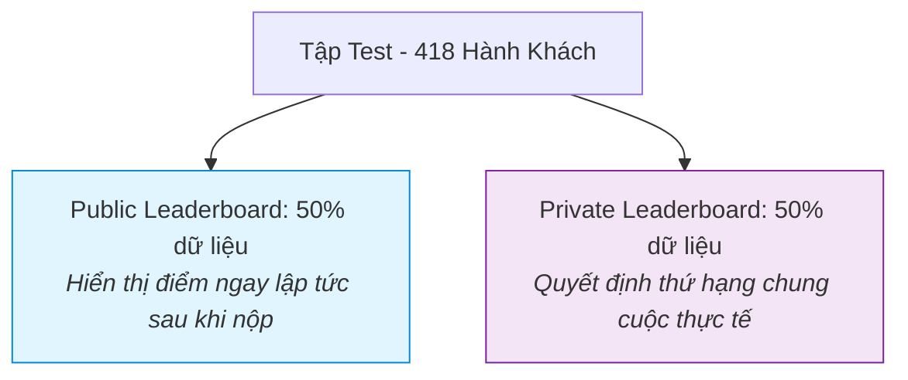

# 🚢 Titanic: Machine Learning from Disaster - Tổng Quan Cuộc Thi (Overview)

> [!ABSTRACT] **Mô Tả Nhanh**
> Đây là cuộc thi khởi đầu ("Hello World") huyền thoại của Kaggle dành cho tất cả mọi người mới bước chân vào Khoa học Dữ liệu (Data Science) và Học máy (Machine Learning).

---

## 1. Bối Cảnh & Thử Thách (The Challenge)

### 🌊 Thảm kịch lịch sử Titanic
Vào ngày 15 tháng 4 năm 1912, trong chuyến hải trình đầu tiên từ Southampton đến New York, con tàu được mệnh danh là "không thể chìm" RMS Titanic đã va phải một tảng băng trôi ở Bắc Đại Tây Dương. 

Do không có đủ xuồng cứu sinh cho tất cả mọi người trên tàu, vụ đắm tàu đã dẫn đến cái chết của **1,502 trên tổng số 2,224 hành khách và thủy thủ đoàn**.

### 🎯 Câu hỏi cốt lõi
Mặc dù sự sống sót có một phần yếu tố may mắn, nhưng rõ ràng một số nhóm người có khả năng sống sót cao hơn những người khác (ví dụ: phụ nữ, trẻ em và tầng lớp thượng lưu).

> **Nhiệm vụ của bạn:** Xây dựng một mô hình dự đoán trả lời cho câu hỏi:
> **"Những nhóm người nào có khả năng sống sót cao hơn?"** 
> dựa trên các dữ liệu hành khách như: Tên, Tuổi, Giới tính, Hạng vé (Kinh tế - Xã hội),...

---

## 2. Tiêu Chí Đánh Giá (Evaluation)

### 📐 Thước đo hiệu năng (Metric): Accuracy
Điểm số của bạn được tính bằng **Độ chính xác phân loại (Categorization Accuracy)**:

$$\text{Accuracy} = \frac{\text{Số dự đoán đúng (True Positives + True Negatives)}}{\text{Tổng số hành khách trong tập Test (418)}}$$

### 📄 Định dạng file nộp bài (Submission Format)
Bạn cần nộp một file `.csv` chứa đúng **418 dòng dự đoán** (kèm 1 dòng header):

```csv
PassengerId,Survived
892,0
893,1
894,0
...
```

---

## 3. Cơ Chế Bảng Xếp Hạng (Leaderboard Mechanics)



> [!IMPORTANT] **Public vs Private Leaderboard:**
> * **Public Leaderboard (50%):** Dùng để phản hồi nhanh sau mỗi lần bạn submit trong quá trình thử nghiệm.
> * **Private Leaderboard (50%):** Đánh giá trên nửa còn lại để kiểm tra khả năng tổng quát hóa (Generalization), tránh việc thí sinh tối ưu quá mức (overfit) lên bảng điểm công khai.

---

## 4. Các Câu Hỏi Thường Gặp (FAQ)

### Q1: Cuộc thi "Getting Started" có gì đặc biệt?
* Đây là cuộc thi không có giải thưởng tiền mặt, không hết hạn (rolling timeline), được thiết kế để học tập và rèn luyện kỹ năng thực chiến.
* Điểm số và huy chương trong cuộc thi này không tính vào cấp bậc Kaggle Grandmaster/Master nhưng là chứng chỉ thực hành tuyệt vời cho profile của bạn.

### Q2: Tôi có thể nộp bao nhiêu lần mỗi ngày?
* Bạn được nộp tối đa **10 lần mỗi ngày (10 submissions / day)**. Giới hạn này sẽ được reset vào 00:00 UTC mỗi ngày.

### Q3: Quy trình từng bước để hoàn thành cuộc thi là gì?
1. **Khám phá dữ liệu (EDA):** Đọc [[train.csv]] và hiểu rõ mối tương quan giữa các đặc trưng.
2. **Tiền xử lý (Preprocessing):** Xử lý dữ liệu thiếu (`Age`, `Cabin`, `Embarked`, `Fare`) theo [[DATA_DICTIONARY.md]].
3. **Kỹ thuật trích xuất đặc trưng (Feature Engineering):** Tạo `Title`, `FamilySize`, `Deck`, `Fare_Per_Person`.
4. **Huấn luyện mô hình:** Thử nghiệm Logistic Regression, Random Forest, XGBoost, LightGBM, CatBoost.
5. **Đánh giá Cross-Validation:** Dùng 5-Fold Stratified CV để đo lường độ chính xác ổn định.
6. **Nộp bài:** Xuất file dự đoán và nộp qua giao diện Kaggle hoặc lệnh Kaggle CLI.
