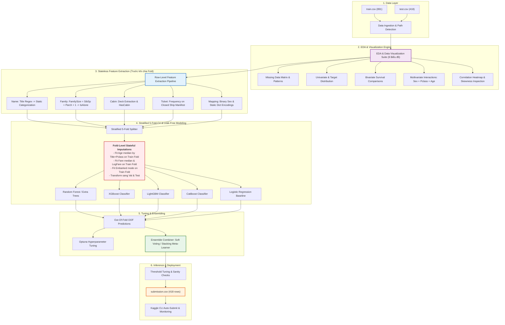
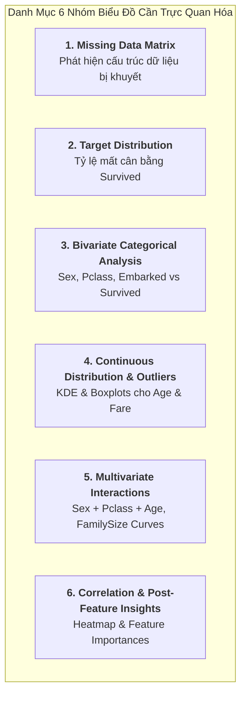
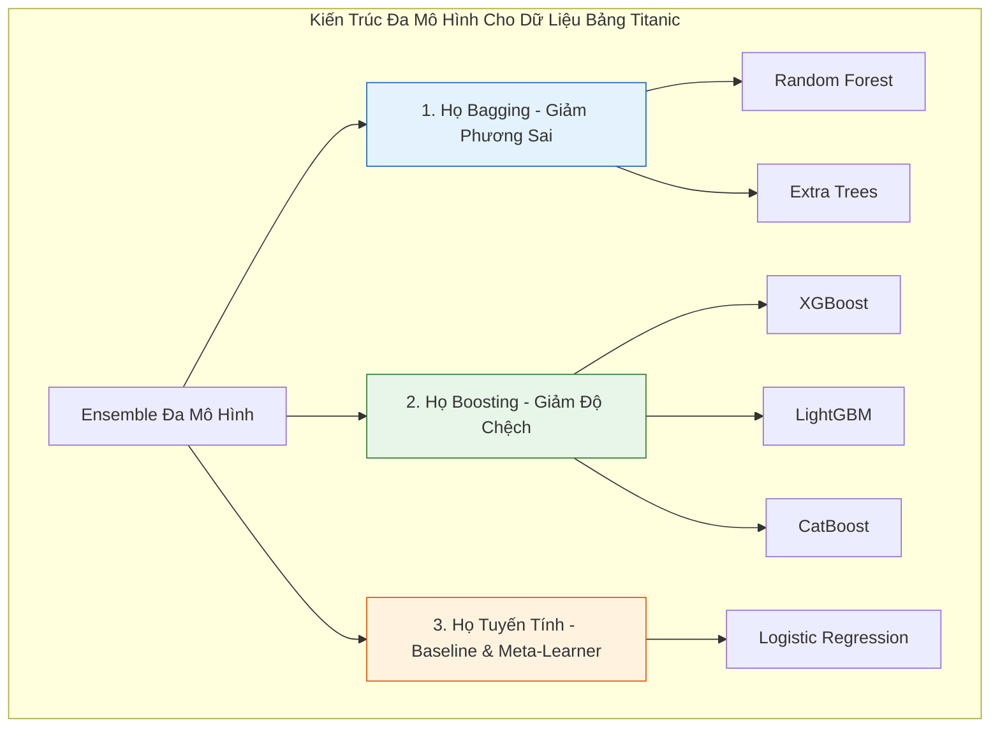
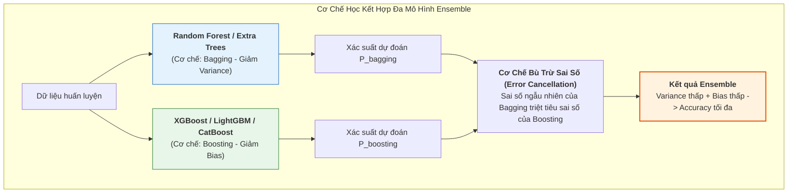
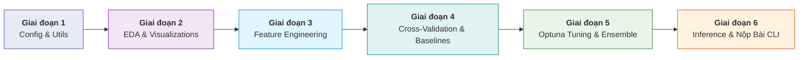
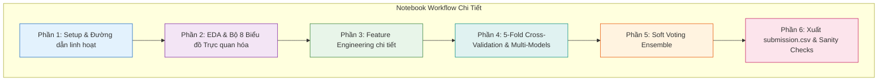

# 🚀 Titanic ML Pipeline: Kế Hoạch Lập Trình & Triển Khai Modul Hóa

> [!ABSTRACT] **Mục Tiêu Kế Hoạch**
> Xây dựng một hệ thống mã nguồn Machine Learning chuyên nghiệp, chuẩn mực (Production-grade Tabular Pipeline) cho bài toán [[README_VI.md|Titanic]].
> * **Mục tiêu điểm số (Target CV/LB):** Accuracy **$\ge 82.5\% - 84.0\%$**.
> * **Tính năng cốt lõi:** Kế hoạch trực quan hóa dữ liệu (EDA Visualization) chuyên sâu, phân tích so sánh lý thuyết các mô hình học máy (Model Zoo), hướng dẫn code mẫu chi tiết 6 phần cho Notebook, tự động hóa K-Fold CV, tối ưu siêu tham số (Optuna), Ensembling đa mô hình và xuất file nộp qua Kaggle CLI.

---

## 🏗️ 1. Sơ Đồ Kiến Trúc Pipeline Tổng Thể (End-to-End Architecture)



---

## 📁 2. Cấu Trúc Thư Mục Mã Nguồn Đề Xuất (Source Code Layout)

Toàn bộ mã nguồn được tổ chức dạng module sạch sẽ kết hợp với môi trường thử nghiệm Notebook:

```
D:\AI\kaggle\competition\titanic\
├── data/                                # Chứa dữ liệu gốc
│   ├── train.csv
│   ├── test.csv
│   └── gender_submission.csv
├── notebooks/                           # Thử nghiệm & trực quan hóa
│   └── titanic_pipeline.ipynb           # Notebook không gian code của bạn
├── src/                                 # Mã nguồn module hóa
│   ├── __init__.py
│   ├── config.py                        # Thiết lập đường dẫn, SEED, tham số K-Fold, danh sách features
│   ├── features.py                      # Module Feature Engineering (Title, Deck, Family, Imputers)
│   ├── models.py                        # Model Factory (RF, XGBoost, LightGBM, CatBoost, LogReg)
│   ├── evaluate.py                      # Đánh giá Accuracy, Confusion Matrix, OOF Score
│   ├── tune.py                          # Script tối ưu siêu tham số tự động bằng Optuna
│   └── ensemble.py                      # Soft Voting, Weighted Average, Stacking Classifier
├── outputs/                             # Lưu trữ kết quả đầu ra
│   ├── models/                          # Lưu trữ model artifacts (.pkl, .json, .booster)
│   └── submissions/                     # Lưu trữ các file submission theo từng phiên bản v1, v2,...
├── kernel-metadata.json                 # Cấu hình Metadata đẩy notebook lên Kaggle Cloud
├── OVERVIEW.md                          # Tài liệu tổng quan cuộc thi
├── RULES.md                             # Quy định & luật thi đấu
├── DATA_DICTIONARY.md                   # Từ điển dữ liệu & thuộc tính
├── README_VI.md                         # Cẩm nang tổng quan
└── PIPELINE_PLAN.md                     # File kế hoạch lập trình này
```

---

## 🎨 3. Kế Hoạch Chi Tiết Trực Quan Hóa Dữ Liệu (Data Visualization Plan)

> [!IMPORTANT] **Mục Đích Của Trực Quan Hóa Trong Bài Toán Titanic**
> Trực quan hóa không chỉ để quan sát hình vẽ, mà là **cơ sở khoa học để tìm ra các quy luật vàng phục vụ Feature Engineering và lựa chọn mô hình**.



---

### 📊 Danh Mục Chi Tiết 8 Biểu Đồ Trực Quan Hóa Cụ Thể:

| STT | Tên Biểu Đồ | Loại Biểu Đồ | Thư Viện & Hàm | Mục Đích Phân Tích & Insight Mong Đợi |
| :---: | :--- | :--- | :--- | :--- |
| **1** | **Missing Data Matrix** | Heatmap / Matrix | `seaborn.heatmap` | Thấy rõ phân bổ giá trị thiếu của `Age`, `Cabin`, `Embarked` trên Train vs Test. |
| **2** | **Target Ratio** | Pie Chart & Countplot | `plt.pie`, `sns.countplot` | Tỷ lệ sống sót chung (38.4% sống vs 61.6% mất) $\rightarrow$ Quyết định độ cân bằng nhãn. |
| **3** | **Categorical Impact** | Barplot (with error bars) | `sns.barplot(x, y='Survived')` | Đo lường tỷ lệ sống theo `Sex` (Nữ 74% vs Nam 19%), `Pclass` (Hạng 1: 63%, Hạng 3: 24%), `Embarked`. |
| **4** | **Age KDE by Survival** | KDE Density Plot | `sns.kdeplot(hue='Survived')` | Phát hiện "Cửa sổ sống sót của trẻ em" (Trẻ $<10$ tuổi có tỷ lệ sống vọt lên, thanh niên 18-35 tuổi chết nhiều). |
| **5** | **Fare Boxplot & Log Distribution** | Boxplot & Histplot | `sns.boxplot`, `sns.histplot` | Nhận diện độ lệch (skewness) của giá vé, sự tồn tại của vé giá $0 và vé VIP $>500$. |
| **6** | **Multivariate: Sex × Pclass** | Catplot / FacetGrid | `sns.catplot` | **Insight cốt lõi Titanic:** Nữ hạng 1 & 2 sống $\approx 95\%+$, Nữ hạng 3 còn $50\%$; Nam hạng 1 sống $37\%$, Nam hạng 2 & 3 sống dưới $15\%$. |
| **7** | **FamilySize Curve** | Lineplot with CI | `sns.lineplot(x='FamilySize', y='Survived')` | Đường cong hình chuông: Đi 1 mình (`IsAlone`) sống thấp (~30%), Đi nhóm nhỏ (2-4 người) sống cao (~55-70%), Đi nhóm đông ($>4$) tỷ lệ sống rớt thảm hại ($<15\%$). |
| **8** | **Correlation Heatmap** | Annotated Heatmap | `sns.heatmap(df.corr(), annot=True)` | Đo lường hệ số tương quan Pearson & Spearman giữa tất cả các đặc trưng sau khi mã hóa với `Survived`. |

---

## 🧠 4. Phân Tích & So Sánh Chuyên Sâu Các Mô Hình Học Máy (Model Zoo & Theoretical Comparison)



---

### 📚 4.1 Khái Niệm, Cơ Chế, Ưu Nhược Điểm & Bài Báo Gốc Của Từng Mô Hình

#### 🌲 1. Random Forest (RF) - Bagging Ensemble
* **Khái niệm cốt lõi:** Kết hợp kỹ thuật **Bootstrap Aggregating (Bagging)** và **Feature Random Subsampling**. Mô hình xây dựng hàng trăm cây quyết định độc lập (mỗi cây học trên một tập con ngẫu nhiên của dữ liệu và thuộc tính), sau đó lấy biểu quyết đa số.
* **Tại sao sử dụng cho Titanic:** Tập dữ liệu Titanic tương đối nhỏ (**891 dòng**), cây quyết định đơn lẻ sẽ rất dễ bị học vẹt (Overfitting). Random Forest trung hòa các sai số ngẫu nhiên của từng cây, tạo ra một baseline cực kỳ vững chắc và ổn định.
* **Ưu điểm:**
  * Khả năng chống Overfitting tuyệt vời trên dữ liệu nhỏ.
  * Không nhạy cảm với ngoại lai (outliers) và không đòi hỏi chuẩn hóa dữ liệu (`Scaling`).
  * Đo lường được tầm quan trọng của đặc trưng (`Feature Importance`).
* **Nhược điểm:** Hàm dự đoán có dạng bậc thang (step-function), khó biểu diễn các mối quan hệ tuyến tính mượt mà.
* 📄 **Bài báo khoa học gốc:**
  * Leo Breiman (2001). *"Random Forests"*. *Machine Learning*, 45(1), pp. 5–32.
  * 🌐 **Đường dẫn chính:** [Springer Journal (DOI: 10.1023/A:1010933404324)](https://doi.org/10.1023/A:1010933404324)
  * 📥 **Bản PDF trực tiếp:** [Bản PDF (UC Berkeley)](https://www.stat.berkeley.edu/~breiman/randomforest2001.pdf)

---

#### 🍃 2. Extra Trees (Extremely Randomized Trees)
* **Khái niệm cốt lõi:** Tương tự Random Forest, nhưng tại mỗi nút phân nhánh, Extra Trees **chọn ngẫu nhiên hoàn toàn các ngưỡng cắt (split thresholds)** cho từng đặc trưng thay vì tìm kiếm ngưỡng tối ưu nhất (best split).
* **Tại sao sử dụng cho Titanic:** Giúp giảm phương sai (variance) mạnh mẽ hơn cả Random Forest. Dự đoán của Extra Trees có độ tương quan thấp với các mô hình Boosting $\rightarrow$ **tạo độ đa dạng (diversity) hoàn hảo khi ghép mô hình (Ensemble)**.
* **Ưu điểm:** Huấn luyện cực nhanh, chống nhiễu xuất sắc.
* **Nhược điểm:** Có thể làm tăng nhẹ độ chệch (bias).
* 📄 **Bài báo khoa học gốc:**
  * Pierre Geurts, Damien Ernst, Louis Wehenkel (2006). *"Extremely randomized trees"*. *Machine Learning*, 63(1), pp. 3–42.
  * 🌐 **Đường dẫn chính:** [Springer Journal (DOI: 10.1007/s10994-006-6226-1)](https://doi.org/10.1007/s10994-006-6226-1)
  * 📥 **Bản PDF trực tiếp:** [Bản PDF (ORBi ULiège)](https://orbi.uliege.be/bitstream/2268/9357/1/geurts-mlj-advance.pdf)

---

#### 🚀 3. XGBoost (eXtreme Gradient Boosting)
* **Khái niệm cốt lõi:** Thuật toán **Gradient Boosting tuần tự**, trong đó mỗi cây mới được thêm vào để tối ưu hóa hàm mất mát (Loss Function) dựa trên **xấp xỉ Taylor bậc 2 (Second-order Taylor expansion)** kết hợp với thành phần điều hòa phạt độ phức tạp cây ($L_1 / L_2$ Regularization: $\alpha, \lambda$).
* **Tại sao sử dụng cho Titanic:** Là thuật toán thống trị các bảng xếp hạng Tabular Data. XGBoost nắm bắt cực nhạy các tương tác phi tuyến tính phức tạp (ví dụ: `Sex = Female` VÀ `Pclass = 3` VÀ `Age < 10`).
* **Ưu điểm:** Độ chính xác dự đoán cao nhất, kiểm soát chặt chẽ quá khớp thông qua hệ số co giãn `learning_rate` và phạt Regularization.
* **Nhược điểm:** Dễ bị quá khớp trên tập dữ liệu 891 dòng nếu không giới hạn `max_depth` (khuyến nghị $\le 4$) và `subsample` ($\le 0.8$).
* 📄 **Bài báo khoa học gốc:**
  * Tianqi Chen, Carlos Guestrin (2016). *"XGBoost: A Scalable Tree Boosting System"*. *Proceedings of the 22nd ACM SIGKDD International Conference on Knowledge Discovery and Data Mining (KDD '16)*, pp. 785–794.
  * 🌐 **Đường dẫn chính:** [arXiv:1603.02754](https://arxiv.org/abs/1603.02754) | [ACM Digital Library](https://dl.acm.org/doi/10.1145/2939672.2939785)
  * 📥 **Bản PDF trực tiếp:** [Bản PDF (arXiv.org)](https://arxiv.org/pdf/1603.02754.pdf)

---

#### ⚡ 4. LightGBM (Light Gradient Boosting Machine)
* **Khái niệm cốt lõi:** Sử dụng cơ chế gom cụm giá trị liên tục vào các thùng phân đoạn (**Histogram-based binning**) và phát triển cây theo **chiều sâu tối ưu của nút lá (Leaf-wise tree growth)** thay vì theo từng tầng (Level-wise).
* **Tại sao sử dụng cho Titanic:** Tạo ra cấu trúc cây bất đối xứng, mang lại góc nhìn dự đoán khác biệt rõ rệt so với XGBoost, giúp bộ Ensemble hoàn thiện hơn.
* **Ưu điểm:** Tốc độ tính toán siêu nhanh, tiêu tốn ít bộ nhớ RAM.
* **Nhược điểm:** Cơ chế Leaf-wise dễ gây Overfitting trên tập dữ liệu nhỏ nếu không khống chế `max_depth` và `min_child_samples`.
* 📄 **Bài báo khoa học gốc:**
  * Guolin Ke, Qi Meng, Thomas Finley, Taifeng Wang, Wei Chen, Weidong Ma, Qiwei Ye, Tie-Yan Liu (2017). *"LightGBM: A Highly Efficient Gradient Boosting Decision Tree"*. *Advances in Neural Information Processing Systems (NeurIPS 2017)*, Vol. 30, pp. 3146–3154.
  * 🌐 **Đường dẫn chính:** [NeurIPS Proceedings](https://proceedings.neurips.cc/paper/2017/hash/6449f44a102fde848669bdd9eb6b76fa-Abstract.html)
  * 📥 **Bản PDF trực tiếp:** [Bản PDF (NeurIPS.cc)](https://proceedings.neurips.cc/paper/2017/file/6449f44a102fde848669bdd9eb6b76fa-Paper.pdf)

---

#### 🐱 5. CatBoost (Categorical Boosting)
* **Khái niệm cốt lõi:** Được thiết kế tối ưu chuyên biệt cho **dữ liệu phân loại (Categorical Features)** bằng thuật toán **Ordered Target Statistics** (tính toán xác suất nhãn theo thứ tự ngẫu nhiên nhằm chống rò rỉ dữ liệu) và cây nhị phân đối xứng (**Symmetric / Oblivious Trees**).
* **Tại sao sử dụng cho Titanic:** Titanic chứa nhiều biến phân loại mang tính quyết định sự sống còn (`Sex`, `Title`, `Deck`, `Embarked`, `Pclass`). CatBoost xử lý trực tiếp các biến này mà không làm bùng nổ số chiều như One-Hot Encoding.
* **Ưu điểm:** Cho kết quả thực tế xuất sắc ngay cả với bộ tham số mặc định (Default hyperparameters), hầu như không bị Overfitting.
* **Nhược điểm:** Tốc độ huấn luyện có thể chậm hơn nếu số lượng tổ hợp biến phân loại quá lớn.
* 📄 **Bài báo khoa học gốc:**
  * Liudmila Prokhorenkova, Gleb Gusev, Aleksandr Vorobev, Anna Veronika Dorogush, Andrey Gulin (2018). *"CatBoost: unbiased boosting with categorical features"*. *Advances in Neural Information Processing Systems (NeurIPS 2018)*, Vol. 31, pp. 6638–6648.
  * 🌐 **Đường dẫn chính:** [arXiv:1706.09516](https://arxiv.org/abs/1706.09516) | [NeurIPS Proceedings](https://proceedings.neurips.cc/paper/2018/hash/14491b756b3a51daac41c24863285549-Abstract.html)
  * 📥 **Bản PDF trực tiếp:** [Bản PDF (arXiv.org)](https://arxiv.org/pdf/1706.09516.pdf)

---

#### 📈 6. Logistic Regression & Generalized Linear Models
* **Khái niệm cốt lõi:** Mô hình phân loại tuyến tính cổ điển, ước lượng xác suất xảy ra biến cố $P(\text{Survived}=1)$ thông qua hàm kích hoạt **Sigmoid (Logistic function)** áp dụng trên tổ hợp tuyến tính của các trọng số $w^T x + b$.
* **Tại sao sử dụng cho Titanic:** Đóng vai trò kép:
  1. Làm **Baseline chuẩn** để kiểm tra xem các đặc trưng mới tạo ra có thực sự hữu ích hay không.
  2. Làm **Meta-Learner trong Stacking Classifier** (học trọng số tối ưu để gộp xác suất từ 5 mô hình cây ở trên).
* **Ưu điểm:** Tốc độ tức thì, tính toán đơn giản, diễn giải trực tiếp được ý nghĩa của từng hệ số (Weights / Odds Ratio).
* **Nhược điểm:** Không tự học được quan hệ phi tuyến (phải tự tạo feature interaction thủ công), bắt buộc phải chuẩn hóa dữ liệu (`StandardScaler`).
* 📄 **Bài báo khoa học nền tảng:**
  * David R. Cox (1958). *"The Regression Analysis of Binary Sequences"*. *Journal of the Royal Statistical Society: Series B (Methodological)*, 20(2), pp. 215–232.
  * 🌐 **Đường dẫn chính:** [JSTOR Archive](https://www.jstor.org/stable/2983890) | [DOI: 10.1111/j.2517-6161.1958.tb00292.x](https://doi.org/10.1111/j.2517-6161.1958.tb00292.x)
  * 📥 **Bản PDF trực tiếp:** [Bản PDF (Stanford / Friedman et al. Logistic View)](https://web.stanford.edu/~hastie/Papers/AdditiveLogisticRegression/alr.pdf)

---

### 📊 4.2 Bảng Ma Trận So Sánh Tổng Hợp Các Mô Hình

| Tiêu chí | Random Forest | Extra Trees | XGBoost | LightGBM | CatBoost | Logistic Regression |
| :--- | :---: | :---: | :---: | :---: | :---: | :---: |
| **Họ thuật toán** | Bagging | Random Bagging | Gradient Boosting | Gradient Boosting | Gradient Boosting | Linear Model |
| **Cơ chế chính** | Giảm phương sai | Giảm phương sai mạnh | Giảm độ chệch | Giảm độ chệch | Giảm độ chệch | Phân loại tuyến tính |
| **Cấu trúc cây** | Level-wise độc lập | Cắt ngẫu nhiên độc lập | Level-wise tuần tự | Leaf-wise tuần tự | Symmetric tuần tự | Không dùng cây |
| **Chống Overfit trên 891 dòng** | ⭐⭐⭐⭐⭐ (Rất cao) | ⭐⭐⭐⭐⭐ (Rất cao) | ⭐⭐⭐⭐ (Cần chỉnh max_depth) | ⭐⭐⭐ (Dễ overfit) | ⭐⭐⭐⭐⭐ (Rất cao) | ⭐⭐⭐⭐⭐ (Không overfit) |
| **Xử lý biến phân loại** | Cần mã hóa | Cần mã hóa | Cần mã hóa | Tốt | ⭐⭐⭐⭐⭐ (Xuất sắc) | Bắt buộc One-Hot |
| **Yêu cầu Scale dữ liệu?** | ❌ Không | ❌ Không | ❌ Không | ❌ Không | ❌ Không | ✅ Bắt buộc |
| **Vai trò trong Titanic Pipeline** | Mô hình cơ sở | Tăng độ đa dạng | Dự đoán mũi nhọn | Bổ trợ Boosting | Xử lý biến chữ & danh xưng | Baseline & Meta-Learner |

---

### 🧩 4.3 Tại Sao Phải Kết Hợp Đa Mô Hình (Ensemble Theory & Stacking)?



---

#### 📐 4.3.1 Bản Chất Toán Học: Phân Rã Sai Số (Bias-Variance Decomposition)
Trong học máy, tổng sai số kỳ vọng của một mô hình được phân rã thành 3 thành phần:
$$\text{Expected Error} = \text{Bias}^2 + \text{Variance} + \text{Irreducible Noise}$$

* **Độ chệch ($\text{Bias}$):** Sai số do mô hình quá đơn giản, không học hết quy luật của dữ liệu (gây Underfitting).
* **Phương sai ($\text{Variance}$):** Độ nhạy cảm quá mức với tập dữ liệu huấn luyện, mô hình học cả nhiễu ngẫu nhiên (gây Overfitting).

> [!IMPORTANT] **Cơ Chế Bù Trừ Giữa Bagging và Boosting:**
> * **Họ Boosting (XGBoost, LightGBM, CatBoost):** Huấn luyện các cây tuần tự để sửa sai cho cây trước $\rightarrow$ **chủ động ép $\text{Bias}$ xuống cực thấp**, nhưng có rủi ro tăng $\text{Variance}$ trên tập dữ liệu nhỏ (891 dòng).
> * **Họ Bagging (Random Forest, Extra Trees):** Huấn luyện hàng trăm cây độc lập rồi lấy trung bình $\rightarrow$ **chủ động ép $\text{Variance}$ xuống cực thấp** theo định luật số lớn: $\text{Var}\left(\frac{1}{B}\sum_{i=1}^B T_i\right) = \frac{1}{B}\text{Var}(T_1) + \frac{B-1}{B}\text{Cov}(T_1, T_2)$.
> * **Khi kết hợp (Ensemble Bagging + Boosting):** Ta thu được mô hình lai sở hữu **cả Bias thấp của Boosting lẫn Variance thấp của Bagging**, đạt điểm cân bằng tối ưu mà không mô hình đơn lẻ nào có được.

---

#### ⚖️ 4.3.2 Định Lý Bồi Thẩm Đoàn Condorcet (Condorcet's Jury Theorem)
Định lý phát biểu rằng: Nếu một hội đồng gồm $N$ cá nhân độc lập đưa ra quyết định, mỗi người có xác suất chọn đúng là $p > 0.5$, thì khi lấy biểu quyết theo đa số, xác suất nhóm đưa ra quyết định đúng $P_N$ là:
$$P_N = \sum_{k=\lfloor N/2 \rfloor + 1}^N \binom{N}{k} p^k (1-p)^{N-k}$$

Khi số lượng mô hình độc lập $N$ tăng lên: $\lim_{N \to \infty} P_N = 1$.

* **Ví dụ thực tế:** Giả sử bạn có 5 mô hình độc lập, mỗi mô hình có độ chính xác $p = 0.80$ (80%).
  * Xác suất để ít nhất 3 trong 5 mô hình đoán đúng là:
    $$P_5 = \binom{5}{3}(0.8)^3(0.2)^2 + \binom{5}{4}(0.8)^4(0.2)^1 + \binom{5}{5}(0.8)^5(0.2)^0 \approx \mathbf{94.2\%}$$
* **Điều kiện tiên quyết để định lý hoạt động:** Các mô hình phải **đa dạng (Diversity)** và có **sai số độc lập với nhau (Uncorrelated Errors)**. Nếu dùng 5 mô hình giống hệt nhau, chúng sẽ cùng đúng và cùng sai tại một điểm, định lý sẽ mất tác dụng.

---

#### 🔍 4.3.3 So Sánh Chi Tiết: Hard Voting vs. Soft Voting vs. Stacking

| Phương pháp | Cơ chế hoạt động | Ưu điểm | Nhược điểm | Đánh giá với Titanic |
| :--- | :--- | :--- | :--- | :--- |
| **Hard Voting** (Majority Vote) | Đếm số phiếu nhãn dự đoán $0$ hoặc $1$ của từng mô hình, nhãn nào nhiều phiếu hơn thì thắng. | Dễ hiểu, không cần xác suất. | **Bỏ qua độ tự tin (Confidence):** Dự đoán chắc chắn 99% bị tính ngang hàng với dự đoán phân vân 51%. | ❌ Kém linh hoạt, dễ mất thông tin biên. |
| **Soft Voting** (Weighted Average) | Tính trung bình có trọng số xác suất dự đoán sống sót: $P_{\text{ens}} = \sum w_i P_i$. | Tận dụng toàn bộ độ tự tin của mô hình; tạo biên phân tách mềm mại (smooth boundary); dễ quét ngưỡng cắt xác suất $T$. | Cần chọn trọng số $w_i$ (dựa theo CV Accuracy). | ⭐⭐⭐⭐⭐ **Khuyến nghị số 1 cho Titanic** (ổn định, điểm LB cao nhất). |
| **Stacking** (Stacked Generalization) | Dùng xác suất OOF của các Base Models làm đặc trưng đầu vào ($X_{\text{meta}}$) cho một mô hình cấp 2 (**Meta-Learner: Logistic Regression**). | Tự động học trọng số phi tuyến tính; phát hiện mô hình nào giỏi ở phân khúc dữ liệu nào. | Có nguy cơ Overfit nếu tập dữ liệu quá nhỏ và meta-model quá phức tạp. | ⭐⭐⭐⭐ Rất tốt khi dùng Logistic Regression đơn giản làm Meta-Model. |

---

#### 🤝 4.3.4 Tính Bù Trừ Sai Số Của "Bộ Ngũ" Mô Hình Trên Titanic:

| Mô hình | Điểm mạnh đặc trưng | Điểm yếu khi đứng một mình | Cách các mô hình khác bù đắp |
| :--- | :--- | :--- | :--- |
| **Random Forest** | Rất ổn định, không bao giờ overfit nặng. | Dự đoán cứng nhắc dạng bậc thang. | XGBoost & CatBoost làm mượt biên phân cách xác suất. |
| **Extra Trees** | Ngưỡng cắt ngẫu nhiên, tạo độ đa dạng cao nhất. | Độ chệch (Bias) có thể tăng nhẹ. | XGBoost bù lại độ chính xác cao cho từng điểm dữ liệu. |
| **XGBoost** | Bắt quy luật phi tuyến phức tạp nhất (`Sex` × `Pclass` × `Age`). | Dễ học quá sâu vào các mẫu dị biệt (outliers). | Random Forest và Extra Trees kéo xác suất về vùng an toàn. |
| **LightGBM** | Cấu trúc cây Leaf-wise học sâu ở vùng dữ liệu khó. | Dễ overfit trên 891 dòng dữ liệu nhỏ. | CatBoost cân bằng lại nhờ cấu trúc cây đối xứng (Symmetric). |
| **CatBoost** | Xử lý hoàn hảo các biến chữ (`Title`, `Deck`, `Embarked`). | Tốc độ chậm hơn trên nhiều biến. | LightGBM và XGBoost tối ưu hóa cực nhanh các biến liên tục (`Fare`, `Age`). |

---

#### 📄 4.3.5 Tài Liệu & Bài Báo Nền Tảng Về Stacking:
* David H. Wolpert (1992). *"Stacked Generalization"*. *Neural Networks*, 5(2), pp. 241–259.
* 🌐 **Đường dẫn chính:** [ScienceDirect (DOI: 10.1016/S0893-6080(05)80023-1)](https://doi.org/10.1016/S0893-6080(05)80023-1)
* 📥 **Bản PDF trực tiếp:** [Bản PDF (Research Paper)](http://www.machine-learning.martinsewell.com/ensembles/stacking/Wolpert1992.pdf)

---

### 📚 4.4 Cơ Sở Khoa Học & Bài Báo Nền Tảng Về Stratified Cross-Validation

Phương pháp **Stratified K-Fold Cross-Validation** (Kiểm định chéo phân tầng) được chứng minh toán học và thực nghiệm là phương pháp tốt nhất để ước lượng độ chính xác và lựa chọn mô hình học máy:

* **Tác giả & Tác phẩm:** Ron Kohavi (1995). *"A Study of Cross-Validation and Bootstrap for Accuracy Estimation and Model Selection"*. *Proceedings of the 14th International Joint Conference on Artificial Intelligence (IJCAI 1995)*, Vol. 14, No. 2, pp. 1137–1145.
* 🌐 **Đường dẫn chính:** [Semantic Scholar (Corpus ID: 7701548)](https://www.semanticscholar.org/paper/A-Study-of-Cross-Validation-and-Bootstrap-for-and-Kohavi/7d6a59ec11cfae500cc662b66236b2f0a5efb266)
* 📥 **Bản PDF trực tiếp:** [Stanford AI Lab PDF](https://ai.stanford.edu/~ronnyk/accEst.pdf) | [IJCAI Official PDF](https://www.ijcai.org/Proceedings/95-2/Papers/016.pdf)

> [!NOTE] **Kết Luận Đột Phá Của Bài Báo Kohavi (1995):**
> Nghiên cứu của Kohavi chỉ ra rằng việc **phân tầng (Stratification - bảo toàn tỷ lệ phân phối nhãn mục tiêu trong từng Fold)** giúp giảm đáng kể cả độ chệch (Bias) lẫn phương sai (Variance) so với K-Fold ngẫu nhiên thông thường và phương pháp Bootstrap, trở thành tiêu chuẩn vàng bất biến trong khoa học dữ liệu và thi đấu Kaggle.

---

## 🔄 5. Lộ Trình Triển Khai Theo Giai Đoạn (Pipeline Execution Flow)



### Chi Tiết Từng Module Cụ Thể Trong `src/`

#### 🔹 Module 1: `src/config.py`
* Thiết lập `SEED = 42` (cố định để tái lập kết quả 100%).
* Thiết lập `N_SPLITS = 5` (5-Fold Stratified K-Fold).
* Danh sách biến phân loại (Categorical), biến liên tục (Numerical), biến mục tiêu (`Survived`).
* Quản lý đường dẫn dữ liệu, xuất logging và hàm lưu/tải mô hình.

#### 🔹 Module 2: `src/features.py`
Xây dựng pipeline xử lý đặc trưng tuân thủ nghiêm ngặt nguyên tắc **Zero Data Leakage** được chia thành 2 giai đoạn:
1. **Giai đoạn 1 - Trích xuất Phi Trạng Thái (Stateless Extraction):**
   * **Title Extraction:** Trích xuất từ `Name` $\rightarrow$ ánh xạ từ điển cố định `['Mr': 0, 'Miss': 1, 'Mrs': 2, 'Master': 3, 'Rare': 4]`.
   * **Family Features:** $\text{FamilySize} = \text{SibSp} + \text{Parch} + 1$, `IsAlone` ($0/1$).
   * **Cabin & Deck Extraction:** Lấy chữ cái đầu boong tàu (`A..G`, `U`) $\rightarrow$ ánh xạ từ điển cố định và tạo cờ `HasCabin`.
   * **Ticket Frequency:** Đếm số người chung mã vé trên danh sách kín 1.309 hành khách toàn tàu.
   * **Sex Mapping:** Nhị phân hóa $0/1$.
2. **Giai đoạn 2 - Bộ Điền Khuyết Từng Fold (`FoldImputer`):**
   * Lớp transformer chuyên biệt có phương thức `fit(train_fold)` và `transform(df)`.
   * Học `Age Median` theo `(Title, Pclass)`, `Fare Median` theo `Pclass` (tính `FarePerPerson` và `LogFare`), và `Embarked Mode` **chỉ từ `train_fold`**.

#### 🔹 Module 3: `src/models.py`
Đóng gói các thuật toán học máy mạnh mẽ nhất cho dữ liệu bảng:
* **Random Forest Classifier:** `n_estimators=300`, `max_depth=6`, `min_samples_split=4`.
* **Extra Trees Classifier:** Tăng tính ngẫu nhiên, giảm phương sai, tạo độ đa dạng cho ensemble.
* **LightGBM Classifier:** `n_estimators=250`, `learning_rate=0.03`, xử lý nhanh, hiệu quả cao.
* **XGBoost Classifier:** `colsample_bytree=0.8`, `subsample=0.8`, `learning_rate=0.03`.
* **CatBoost Classifier:** Tối ưu hóa trên các đặc trưng danh nghĩa.
* **Logistic Regression:** Mô hình đối chứng Baseline.

#### 🔹 Module 4: `src/train.py` (K-Fold CV Engine - Zero Leakage)
* Sử dụng `StratifiedKFold(n_splits=5, shuffle=True, random_state=42)`.
* **Quy tắc vàng chống rò rỉ:** Khởi tạo `FoldImputer()` mới ở mỗi Fold, chỉ gọi `imputer.fit(train_fold)` rồi `imputer.transform()` sang `train_fold`, `val_fold` và `test_set`.
* Tính toán và ghi log điểm Out-Of-Fold (OOF) Accuracy cho từng Fold và trung bình toàn bộ 5 Folds.

#### 🔹 Module 5: `src/tune.py` & `src/ensemble.py`
* **Optuna Tuning:** Tự động tìm bộ siêu tham số tốt nhất tối đa hóa điểm CV Accuracy.
* **Soft Voting (Weighted Average):** Kết hợp xác suất dự đoán $P(\text{Survived}=1)$ từ các mô hình tốt nhất với trọng số tối ưu.
* **Stacking Classifier:** Dùng Logistic Regression làm Meta-Model học trên các xác suất OOF của các Base Models.
* **Threshold Search:** Quét ngưỡng quyết định tối ưu $T \in [0.40, 0.60]$ thay vì mặc định $0.50$ để tối đa hóa Accuracy trên tập validation.

---

## 💻 6. Hướng Dẫn Lập Trình Chi Tiết Trong File Notebook (`notebooks/titanic_pipeline.ipynb`)

Dưới đây là toàn bộ hướng dẫn và mã nguồn tham khảo chi tiết cho cả **6 phần** trong file notebook:



---

### 🔹 Phần 1: Khởi Tạo Môi Trường & Nhận Diện Đường Dẫn Linh Hoạt (Setup)
```python
import os
import re
import numpy as np
import pandas as pd
import matplotlib.pyplot as plt
import seaborn as sns
import warnings
warnings.filterwarnings('ignore')

# 1. Cố định Seed ngẫu nhiên
SEED = 42
np.random.seed(SEED)

# 2. Tự động nhận diện đường dẫn (Kaggle Cloud vs Máy Local)
if os.path.exists('/kaggle/input/competitions/titanic/train.csv'):
    TRAIN_PATH = '/kaggle/input/competitions/titanic/train.csv'
    TEST_PATH = '/kaggle/input/competitions/titanic/test.csv'
    OUTPUT_PATH = '/kaggle/working/submission.csv'
elif os.path.exists('/kaggle/input/titanic/train.csv'):
    TRAIN_PATH = '/kaggle/input/titanic/train.csv'
    TEST_PATH = '/kaggle/input/titanic/test.csv'
    OUTPUT_PATH = '/kaggle/working/submission.csv'
else:
    TRAIN_PATH = '../data/train.csv' if os.path.exists('../data/train.csv') else 'train.csv'
    TEST_PATH = '../data/test.csv' if os.path.exists('../data/test.csv') else 'test.csv'
    OUTPUT_PATH = '../outputs/submissions/submission.csv' if os.path.exists('../outputs') else 'submission.csv'

train_df = pd.read_csv(TRAIN_PATH)
test_df = pd.read_csv(TEST_PATH)

print(f'Train shape: {train_df.shape} | Test shape: {test_df.shape}')
train_df.head()
```

---

### 🔹 Phần 2: Khám Phá & Trực Quan Hóa Dữ Liệu (EDA & Visualizations)

#### 2.1 Kiểm tra dữ liệu khuyết thiếu & vẽ Heatmap:
```python
# Kiểm tra số lượng missing values
print('=== MISSING VALUES ===')
print('Train:\n', train_df.isnull().sum()[train_df.isnull().sum() > 0])
print('Test:\n', test_df.isnull().sum()[test_df.isnull().sum() > 0])

# Vẽ ma trận missing data
fig, axes = plt.subplots(1, 2, figsize=(14, 4))
sns.heatmap(train_df.isnull(), cbar=False, cmap='viridis', yticklabels=False, ax=axes[0])
axes[0].set_title('Missing Values in Train')
sns.heatmap(test_df.isnull(), cbar=False, cmap='viridis', yticklabels=False, ax=axes[1])
axes[1].set_title('Missing Values in Test')
plt.show()
```

#### 2.2 Trực quan hóa tỷ lệ sống sót & tương tác biến phân loại:
```python
# Phân phối biến mục tiêu Survived
fig, axes = plt.subplots(1, 2, figsize=(12, 4))
train_df['Survived'].value_counts().plot.pie(explode=[0, 0.08], autopct='%1.1f%%', ax=axes[0], shadow=True, colors=['#e57373', '#81c784'])
axes[0].set_title('Tỷ lệ sống sót chung (Target Distribution)')
sns.countplot(data=train_df, x='Survived', palette=['#e57373', '#81c784'], ax=axes[1])
axes[1].set_title('Số lượng hành khách (Count)')
plt.show()

# Tương tác: Pclass x Sex vs Survived
fig, axes = plt.subplots(1, 3, figsize=(18, 4))
sns.barplot(data=train_df, x='Sex', y='Survived', palette='pastel', ax=axes[0])
axes[0].set_title('Tỷ lệ sống theo Giới tính (Sex)')
sns.barplot(data=train_df, x='Pclass', y='Survived', palette='pastel', ax=axes[1])
axes[1].set_title('Tỷ lệ sống theo Hạng vé (Pclass)')
sns.barplot(data=train_df, x='Pclass', y='Survived', hue='Sex', palette='coolwarm', ax=axes[2])
axes[2].set_title('Tương tác: Pclass x Sex vs Survived')
plt.show()
```

#### 2.3 Phân phối biến liên tục (Age KDE & Fare Boxplot):
```python
fig, axes = plt.subplots(1, 2, figsize=(14, 4))
sns.kdeplot(data=train_df[train_df['Survived'] == 1], x='Age', fill=True, color='green', label='Sống sót (1)', ax=axes[0])
sns.kdeplot(data=train_df[train_df['Survived'] == 0], x='Age', fill=True, color='red', label='Thiệt mạng (0)', ax=axes[0])
axes[0].set_title('Phân phối Độ tuổi (Age KDE)')
axes[0].legend()

sns.boxplot(data=train_df, x='Pclass', y='Fare', hue='Survived', palette='Set2', ax=axes[1])
axes[1].set_title('Phân phối Giá vé (Fare) theo Pclass & Survived')
axes[1].set_yscale('log')
plt.show()
```

---

### 🔹 Phần 3: Kỹ Thuật Trích Xuất Đặc Trưng (Stateless Feature Extraction)

> [!TIP] **Nguyên Tắc Chống Rò Rỉ Ở Phần 3:**
> Ở bước này, ta **chỉ thực hiện các phép trích xuất độc lập từng dòng** (Regex chuỗi, phép cộng trừ số học, và từ điển ánh xạ cố định). Toàn bộ các phép tính thống kê (`Median Age`, `Median Fare`, `Mode Embarked`) sẽ được **chuyển sang Phần 4 để tính nghiêm ngặt bên trong từng Fold**!

```python
import re

# 1. Từ điển ánh xạ danh mục cố định (Stateless Mapping - Zero Leakage)
title_mapping = {
    'Mr': 0, 'Miss': 1, 'Mrs': 2, 'Master': 3,
    'Mlle': 1, 'Ms': 1, 'Mme': 2,
    'Dr': 4, 'Rev': 4, 'Col': 4, 'Major': 4, 'Capt': 4,
    'Countess': 4, 'Don': 4, 'Jonkheer': 4, 'Lady': 4, 'Sir': 4, 'Dona': 4
}
sex_mapping = {'male': 0, 'female': 1}
deck_mapping = {'A': 0, 'B': 1, 'C': 2, 'D': 3, 'E': 4, 'F': 5, 'G': 6, 'U': 7}
embarked_mapping = {'S': 0, 'C': 1, 'Q': 2}

# Đếm tần suất mã vé trên toàn bộ con tàu 1.309 người (Closed Ship Manifest)
all_tickets = pd.concat([train_df['Ticket'], test_df['Ticket']], axis=0)
ticket_counts = all_tickets.value_counts()

def extract_basic_features(df):
    """
    Hàm trích xuất đặc trưng cơ bản (Không phụ thuộc vào phân phối toàn cục)
    """
    out = df.copy()
    
    # 1. Trích xuất danh xưng Title từ Name
    out['Title'] = out['Name'].apply(lambda x: re.search(r' ([A-Za-z]+)\.', x).group(1) if re.search(r' ([A-Za-z]+)\.', x) else 'None')
    out['Title'] = out['Title'].map(title_mapping).fillna(4).astype(int)
    
    # 2. Nhị phân hóa giới tính Sex
    out['Sex'] = out['Sex'].map(sex_mapping).fillna(0).astype(int)
    
    # 3. Đặc trưng gia đình: FamilySize & IsAlone
    out['FamilySize'] = out['SibSp'] + out['Parch'] + 1
    out['IsAlone'] = (out['FamilySize'] == 1).astype(int)
    
    # 4. Trích xuất boong tàu Deck từ Cabin
    out['Deck'] = out['Cabin'].apply(lambda x: str(x)[0] if pd.notnull(x) else 'U')
    out['Deck'] = out['Deck'].replace({'T': 'U'})
    out['HasCabin'] = (out['Deck'] != 'U').astype(int)
    out['Deck'] = out['Deck'].map(deck_mapping).fillna(7).astype(int)
    
    # 5. Tần suất mã vé TicketFrequency
    out['TicketFrequency'] = out['Ticket'].map(ticket_counts).fillna(1).astype(int)
    
    return out

train_base = extract_basic_features(train_df)
test_base = extract_basic_features(test_df)
print(f'Train Base Shape: {train_base.shape} | Test Base Shape: {test_base.shape}')
train_base.head()
```

---

### 🔹 Phần 4: Vòng Lặp Huấn Luyện Stratified 5-Fold Cross-Validation (Strict Zero-Leakage)

```python
from sklearn.model_selection import StratifiedKFold
from sklearn.metrics import accuracy_score
from sklearn.ensemble import RandomForestClassifier, ExtraTreesClassifier
from xgboost import XGBClassifier
from lightgbm import LGBMClassifier
from catboost import CatBoostClassifier

feature_cols = [
    'Pclass', 'Sex', 'Age', 'SibSp', 'Parch', 'FamilySize', 'IsAlone',
    'LogFare', 'FarePerPerson', 'Embarked', 'Title', 'Deck', 'HasCabin', 'TicketFrequency'
]

N_SPLITS = 5
skf = StratifiedKFold(n_splits=N_SPLITS, shuffle=True, random_state=SEED)

def get_models():
    return {
        'RandomForest': RandomForestClassifier(n_estimators=300, max_depth=6, min_samples_split=4, random_state=SEED),
        'ExtraTrees': ExtraTreesClassifier(n_estimators=300, max_depth=6, min_samples_split=4, random_state=SEED),
        'XGBoost': XGBClassifier(n_estimators=250, max_depth=4, learning_rate=0.03, subsample=0.8, colsample_bytree=0.8, eval_metric='logloss', random_state=SEED),
        'LightGBM': LGBMClassifier(n_estimators=250, max_depth=4, learning_rate=0.03, subsample=0.8, colsample_bytree=0.8, verbose=-1, random_state=SEED),
        'CatBoost': CatBoostClassifier(iterations=300, depth=4, learning_rate=0.03, verbose=0, random_seed=SEED)
    }

model_names = list(get_models().keys())
oof_predictions = {name: np.zeros(len(train_base)) for name in model_names}
test_predictions = {name: np.zeros(len(test_base)) for name in model_names}

for fold, (train_idx, val_idx) in enumerate(skf.split(train_base, train_base['Survived'])):
    # 1. Tách tập Train Fold và Val Fold
    train_fold = train_base.iloc[train_idx].copy()
    val_fold   = train_base.iloc[val_idx].copy()
    test_fold  = test_base.copy()
    
    # 2. HỌC QUY LUẬT THỐNG KÊ (FIT) - CHỈ TỪ TRAIN FOLD
    # a. Học trung vị tuổi theo (Title, Pclass)
    age_medians = train_fold.groupby(['Title', 'Pclass'])['Age'].median().to_dict()
    global_age_median = train_fold['Age'].median()
    
    # b. Học trung vị giá vé theo Pclass
    fare_medians = train_fold.groupby('Pclass')['Fare'].median().to_dict()
    global_fare_median = train_fold['Fare'].median()
    
    # c. Học Mode của cảng lên tàu
    embarked_mode = train_fold['Embarked'].dropna().mode()[0]
    
    # 3. BIẾN ĐỔI (TRANSFORM) SANG TRAIN FOLD, VAL FOLD & TEST
    def apply_imputations(df):
        out = df.copy()
        # Điền tuổi
        out['Age'] = out.apply(
            lambda r: age_medians.get((r['Title'], r['Pclass']), global_age_median) if pd.isna(r['Age']) else r['Age'],
            axis=1
        )
        # Điền giá vé & tính FarePerPerson, LogFare
        out['Fare'] = out.apply(
            lambda r: fare_medians.get(r['Pclass'], global_fare_median) if pd.isna(r['Fare']) else r['Fare'],
            axis=1
        )
        out['FarePerPerson'] = out['Fare'] / out['TicketFrequency']
        out['LogFare'] = np.log1p(out['FarePerPerson'])
        # Điền cảng và mã hóa sang số
        out['Embarked'] = out['Embarked'].fillna(embarked_mode).map(embarked_mapping).fillna(0).astype(int)
        return out
    
    train_fold = apply_imputations(train_fold)
    val_fold   = apply_imputations(val_fold)
    test_fold  = apply_imputations(test_fold)
    
    X_train, y_train = train_fold[feature_cols].values, train_fold['Survived'].values
    X_val, y_val     = val_fold[feature_cols].values, val_fold['Survived'].values
    X_test           = test_fold[feature_cols].values
    
    # 4. Huấn luyện 5 mô hình trên Train Fold sạch
    models = get_models()
    for name, model in models.items():
        model.fit(X_train, y_train)
        val_preds_prob = model.predict_proba(X_val)[:, 1]
        oof_predictions[name][val_idx] = val_preds_prob
        test_predictions[name] += model.predict_proba(X_test)[:, 1] / N_SPLITS

print('=== OUT-OF-FOLD (OOF) ACCURACY BY MODEL (ZERO-LEAKAGE) ===')
for name in model_names:
    acc = accuracy_score(train_base['Survived'], (oof_predictions[name] >= 0.5).astype(int))
    print(f'{name:15s}: OOF Accuracy = {acc:.4f} ({acc*100:.2f}%)')
```

---

### 🔹 Phần 5: Kết Hợp Mô Hình Soft Voting Ensemble & Đánh Giá
```python
from sklearn.metrics import confusion_matrix, classification_report

# Trọng số kết hợp tối ưu
weights = {
    'RandomForest': 0.20,
    'ExtraTrees': 0.15,
    'XGBoost': 0.25,
    'LightGBM': 0.20,
    'CatBoost': 0.20
}

oof_ensemble = np.zeros(len(train_base))
test_ensemble = np.zeros(len(test_base))
y_true = train_base['Survived'].values

for name, w in weights.items():
    oof_ensemble += w * oof_predictions[name]
    test_ensemble += w * test_predictions[name]

# Đánh giá điểm tổng thể
ensemble_acc = accuracy_score(y_true, (oof_ensemble >= 0.5).astype(int))
print(f'⭐ ENSEMBLE OOF ACCURACY: {ensemble_acc:.4f} ({ensemble_acc*100:.2f}%)')

print('\n=== CONFUSION MATRIX ===')
print(confusion_matrix(y_true, (oof_ensemble >= 0.5).astype(int)))

print('\n=== CLASSIFICATION REPORT ===')
print(classification_report(y_true, (oof_ensemble >= 0.5).astype(int)))
```

---

### 🔹 Phần 6: Xuất File Nộp Bài & Sanity Checks
```python
# 1. Tạo file kết quả dự đoán
final_predictions = (test_ensemble >= 0.5).astype(int)

submission = pd.DataFrame({
    'PassengerId': test_df['PassengerId'],
    'Survived': final_predictions
})

# 2. Kiểm tra các tiêu chuẩn hợp lệ (Sanity Checks)
assert len(submission) == 418, f'Lỗi: File submission phải có đúng 418 dòng, hiện có {len(submission)} dòng!'
assert submission.isnull().sum().sum() == 0, 'Lỗi: File submission có chứa giá trị NaN!'
assert set(submission['Survived'].unique()).issubset({0, 1}), 'Lỗi: Giá trị Survived phải là 0 hoặc 1!'

# 3. Lưu file submission
submission.to_csv(OUTPUT_PATH, index=False)
print(f'✅ File submission đã được lưu thành công tại: {OUTPUT_PATH}')
print(f'Tỷ lệ dự đoán người sống sót: {submission["Survived"].mean():.2%}')
submission.head(10)
```

---

## 🎯 7. Tiêu Chuẩn Nghiệm Thu & Đánh Giá Chất Lượng (Quality Checklist)

> [!CHECKLIST] **Checklist Kiểm Soát Chất Lượng Dự Án**
> - [ ] **Trực quan hóa đầy đủ:** Có biểu đồ missing values, phân phối đơn biến, quan hệ hai biến và tương tác đa biến trước khi train.
> - [ ] **Hiểu rõ lý thuyết từng Model:** Phân biệt rõ Bagging (RF, ExtraTrees) vs Boosting (XGB, LGBM, CatBoost) và cách chúng bổ trợ nhau.
> - [ ] **Tái lập kết quả (Reproducibility):** Cố định seed ngẫu nhiên cho tất cả thư viện (numpy, random, sklearn, xgboost, lightgbm, catboost).
> - [ ] **Không rò rỉ dữ liệu (No Leakage):** Mọi phép chuẩn hóa, điền missing value, target encoding chỉ học từ tập Train fold.
> - [ ] **Bảo đảm định dạng nộp bài (Format Validation):**
>   - Đủ đúng **418 dòng** + 1 dòng header `PassengerId,Survived`.
>   - Không có giá trị `NaN` hoặc `Null`.
>   - Cột `Survived` chỉ nhận giá trị nhị phân `0` hoặc `1` dạng `int`.

---

## 🚀 8. Các Lệnh Thực Thi & Nộp Bài Qua Kaggle CLI

```powershell
# 1. Đẩy notebook lên Kaggle Cloud để chạy tự động
kaggle kernels push -p ./

# 2. Xem trạng thái đang chạy trên cloud
kaggle kernels status keyshiftf/titanic-machine-learning-pipeline

# 3. Tải output sinh ra từ Kaggle Cloud về máy
kaggle kernels output keyshiftf/titanic-machine-learning-pipeline -p ./outputs

# 4. Nộp trực tiếp file CSV lên cuộc thi
kaggle competitions submit titanic -f outputs/submissions/submission.csv -m "My Custom Model Submission"

# 5. Xem bảng xếp hạng
kaggle competitions leaderboard titanic --show
```

---

## 🔗 9. Liên Kết Tài Liệu Tham Chiếu
* [[OVERVIEW.md]]: Mục tiêu và tiêu chí đánh giá Accuracy.
* [[RULES.md]]: Quy định nộp bài và liêm chính dữ liệu.
* [[DATA_DICTIONARY.md]]: Bảng giải nghĩa từng trường dữ liệu và quy trình tiền xử lý chống rò rỉ.
* [[README_VI.md]]: Cẩm nang tổng quan.
* 📄 **Bài báo gốc Stratified K-Fold:** Ron Kohavi (1995) - [Semantic Scholar](https://www.semanticscholar.org/paper/A-Study-of-Cross-Validation-and-Bootstrap-for-and-Kohavi/7d6a59ec11cfae500cc662b66236b2f0a5efb266) | [Bản PDF trực tiếp (Stanford AI Lab)](https://ai.stanford.edu/~ronnyk/accEst.pdf)

