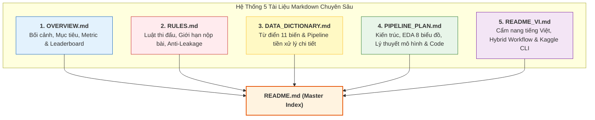

# 🚢 Titanic: Machine Learning from Disaster - Master Project Index

> [!ABSTRACT] **Tổng Quan Dự Án (Executive Summary)**
> Dự án này cung cấp một hệ thống giải pháp Machine Learning hoàn chỉnh, chuẩn mực (Production-grade Tabular Pipeline) cho cuộc thi kinh điển [[OVERVIEW.md|Titanic: Machine Learning from Disaster]] trên nền tảng Kaggle.
> * **Bài toán:** Phân loại nhị phân (Binary Classification) – Dự đoán hành khách sống sót (`Survived = 1`) hay thiệt mạng (`Survived = 0`).
> * **Thang đo đánh giá (Metric):** **Categorization Accuracy** ($\frac{\text{Số dự đoán đúng}}{\text{Tổng số hành khách}}$).
> * **Mục tiêu điểm số (Target Score):** Accuracy **$\ge 82.5\% - 84.0\%$** trên cả Cross-Validation (CV) và Leaderboard (LB).
> * **Kiến trúc cốt lõi:** Kết hợp giữa sổ tay thử nghiệm trực quan [[notebooks/titanic_pipeline.ipynb|Jupyter Notebook]] và hệ thống mã nguồn module hóa sạch sẽ trong thư mục `src/`, áp dụng quy trình kiểm định Stratified 5-Fold CV chống rò rỉ dữ liệu (No Leakage) và Soft Voting Ensemble đa mô hình.

---

## 📁 1. Cấu Trúc Tổng Thể Thư Mục Dự Án (Project Structure)

```
D:\AI\kaggle\competition\titanic\
├── data/                                # Chứa toàn bộ dữ liệu gốc của cuộc thi
│   ├── train.csv                        # Tập huấn luyện (891 dòng, có nhãn Survived)
│   ├── test.csv                         # Tập kiểm tra (418 dòng, cần dự đoán Survived)
│   └── gender_submission.csv            # File mẫu nộp bài baseline của Kaggle (Nữ sống / Nam chết)
├── notebooks/                           # Không gian thử nghiệm & trực quan hóa EDA
│   └── titanic_pipeline.ipynb           # Notebook quy trình 6 bước hoàn chỉnh để tự lập trình
├── src/                                 # Mã nguồn module hóa chuẩn Production
│   ├── __init__.py                      # Đánh dấu package Python
│   ├── config.py                        # Cấu hình trung tâm: Đường dẫn, SEED=42, N_SPLITS=5, danh sách cột
│   ├── features.py                      # Module Feature Engineering (Title, Deck, FamilySize, Imputers)
│   ├── models.py                        # Model Factory (Random Forest, Extra Trees, XGBoost, LightGBM, CatBoost)
│   ├── evaluate.py                      # Đánh giá Accuracy, Confusion Matrix, OOF Score
│   └── ensemble.py                      # Soft Voting, Weighted Average, Stacking Classifier
├── outputs/                             # Nơi lưu trữ artifacts sinh ra trong quá trình chạy
│   ├── models/                          # Lưu trữ model artifacts (.pkl, .json, .booster)
│   └── submissions/                     # Lưu trữ các file submission.csv theo từng phiên bản
├── kernel-metadata.json                 # Cấu hình Kaggle API để tự động đẩy notebook lên Kaggle Cloud
├── OVERVIEW.md                          # [Tài liệu] Tổng quan cuộc thi, bối cảnh lịch sử, Metric, Leaderboard
├── RULES.md                             # [Tài liệu] Luật thi đấu, giới hạn nộp bài, đạo đức liêm chính dữ liệu
├── DATA_DICTIONARY.md                   # [Tài liệu] Từ điển 11 đặc trưng & quy trình tiền xử lý chi tiết
├── PIPELINE_PLAN.md                     # [Tài liệu] Kế hoạch kiến trúc, EDA 8 biểu đồ, so sánh lý thuyết mô hình
├── README_VI.md                         # [Tài liệu] Cẩm nang tiếng Việt, Hybrid Workflow & Kaggle CLI
└── README.md                            # [Tài liệu] File mục lục tổng hợp toàn bộ dự án này
```

---

## 📂 2. Chi Tiết Nội Dung Từng Thư Mục (Directory Contents)

### 📊 1. Thư mục `data/`
Lưu trữ bộ dữ liệu chính thức được tải trực tiếp từ Kaggle:
* **`train.csv` (891 dòng × 12 cột):** Dữ liệu hành khách đầy đủ thông tin định danh, nhân khẩu học, vé, khoang phòng và biến mục tiêu `Survived` (342 người sống ~38.38%, 549 người chết ~61.62%).
* **`test.csv` (418 dòng × 11 cột):** Dữ liệu hành khách kiểm thử không chứa cột `Survived`. Nhiệm vụ của mô hình là suy luận nhãn cho 418 hành khách này.
* **`gender_submission.csv` (418 dòng × 2 cột):** File submission mẫu của ban tổ chức Kaggle, đóng vai trò làm mẫu định dạng chuẩn (`PassengerId,Survived`) và kiểm tra cột mốc baseline ban đầu (~76.5% Accuracy).

---

### 📓 2. Thư mục `notebooks/`
* **`titanic_pipeline.ipynb`:** Không gian làm việc thử nghiệm tương tác (Interactive Workspace) được chia sẵn thành 6 giai đoạn rõ ràng:
  1. *Environment Setup & Data Loading:* Tự động phát hiện môi trường chạy (Local vs Kaggle Cloud), cố định `SEED = 42`.
  2. *Exploratory Data Analysis (EDA):* Trực quan hóa dữ liệu thiếu, phân phối đơn biến và tương tác đa biến.
  3. *Feature Engineering & Preprocessing:* Trích xuất danh xưng `Title`, boong tàu `Deck`, `FamilySize`, `FarePerPerson`, và điền khuyết `Age` thông minh.
  4. *Stratified 5-Fold Cross-Validation:* Huấn luyện 5 mô hình học máy đa dạng và lưu trữ xác suất Out-Of-Fold (OOF).
  5. *Ensembling & Evaluation:* Kết hợp mô hình bằng Soft Voting có trọng số và đánh giá ma trận nhầm lẫn.
  6. *Generate Submission File:* Xuất `submission.csv` kèm các dòng lệnh `assert` kiểm tra hợp lệ.

---

### 🐍 3. Thư mục `src/` (Mã Nguồn Module Hóa)
Chứa các module Python độc lập, dễ dàng tái sử dụng và kiểm thử tự động:
* **`config.py`:** Quản lý toàn bộ hằng số toàn cục (`RANDOM_SEED = 42`, `N_SPLITS = 5`), đường dẫn thư mục tuyệt đối (`DATA_DIR`, `MODELS_DIR`, `SUBMISSIONS_DIR`), và danh sách phân loại các cột thuộc tính.
* **`features.py`:** Xây dựng pipeline biến đổi đặc trưng theo chuẩn Scikit-Learn Transformer, đảm bảo mọi phép điền khuyết (Imputation) và mã hóa (Encoding) chỉ học từ Train Fold.
* **`models.py`:** Model Factory khởi tạo và quản lý 5 mô hình mạnh mẽ: **Random Forest**, **Extra Trees**, **XGBoost**, **LightGBM**, **CatBoost**, cùng **Logistic Regression** làm baseline.
* **`evaluate.py`:** Cung cấp các hàm tính toán Accuracy, Confusion Matrix, Classification Report và quét ngưỡng xác suất tối ưu $T^* \in [0.40, 0.60]$.
* **`ensemble.py`:** Triển khai các thuật toán kết hợp đa mô hình: **Weighted Soft Voting** (Trung bình xác suất có trọng số) và **Stacking Classifier** (Meta-Model).

---

### 📦 4. Thư mục `outputs/`
* **`outputs/models/`:** Chứa các file trọng số mô hình đã được huấn luyện (`.pkl`, `.json`, `.booster`) phục vụ việc tái sử dụng hoặc suy luận nhanh (Inference).
* **`outputs/submissions/`:** Nơi lưu trữ các tệp kết quả dự đoán `submission.csv` được đánh dấu theo từng phiên bản thử nghiệm (ví dụ: `submission_v1_rf.csv`, `submission_v2_ensemble.csv`).

---

## 📑 3. Chi Tiết Nội Dung Từng File Markdown Tài Liệu (Markdown Documentation)

Dự án được tài liệu hóa chuyên sâu theo chuẩn Obsidian (hỗ trợ Callouts, Mermaid Diagrams, MathJax LaTeX, và Wikilinks):



---

### 📘 1. [[OVERVIEW.md]] - Tổng Quan Cuộc Thi
* **Bối cảnh lịch sử:** Thảm họa chìm tàu RMS Titanic ngày 15/04/1912 khiến 1502/2224 người thiệt mạng.
* **Mục tiêu kỹ thuật:** Xây dựng mô hình phân loại nhị phân giải quyết câu hỏi: *"Những nhóm hành khách nào có cơ hội sống sót cao hơn?"*.
* **Thang đo đánh giá:** Phân tích chi tiết công thức $\text{Accuracy} = \frac{TP + TN}{TP + TN + FP + FN}$.
* **Cơ chế Leaderboard:** Giải thích sự khác biệt sống còn giữa **Public Leaderboard (50% dữ liệu test)** và **Private Leaderboard (50% dữ liệu test)** để tránh bẫy Overfitting Leaderboard.
* **Bộ câu hỏi thường gặp (FAQ):** Giải đáp về ranh giới điểm số thực tế, tỷ lệ baseline và chiến lược submit an toàn.

---

### ⚖️ 2. [[RULES.md]] - Quy Định & Luật Thi Đấu
* **Quy tắc sở hữu tài khoản:** Mỗi người tham gia chỉ được dùng duy nhất 1 tài khoản cá nhân (One-Account Rule).
* **Giới hạn số lần nộp bài:** Tối đa **10 lần nộp / ngày** (Daily Submission Limit).
* **Quy tắc làm việc nhóm & chia sẻ mã nguồn:** Hướng dẫn chia sẻ công khai qua Kaggle Forum/Kernels, nghiêm cấm trao đổi code riêng tư ngoài đội thi.
* **Đạo đức dữ liệu & Chống rò rỉ (Anti-Leakage Ethics):** Tuyệt đối không sử dụng các tập dữ liệu ngoài (External Ground Truth) chứa danh sách thực tế của người sống sót để gian lận điểm số.

---

### 📖 3. [[DATA_DICTIONARY.md]] - Từ Điển Dữ Liệu & Quy Trình Tiền Xử Lý
* **Mục 1: Phân tích 11 thuộc tính gốc:**
  * Bảng phân tích chi tiết ý nghĩa, kiểu dữ liệu, phân phối và tỷ lệ sống sót theo từng trường (`Pclass`, `Sex`, `Age`, `SibSp`, `Parch`, `Ticket`, `Fare`, `Cabin`, `Embarked`).
* **Mục 2: Quy trình tiền xử lý dữ liệu cho các mô hình đề xuất:**
  * **Sơ đồ Mermaid Preprocessing Pipeline:** Minh họa đường đi từ dữ liệu thô đến ma trận đặc trưng.
  * **Bảng ánh xạ biến đầu vào (Feature Mapping Table):** Liệt kê chi tiết 14 đặc trưng mới được tạo (`Title`, `FamilySize`, `IsAlone`, `TicketFrequency`, `FarePerPerson`, `LogFare`, `Deck`, `HasCabin`).
  * **Quy chuẩn tiền xử lý theo từng họ mô hình:** Phân biệt rõ yêu cầu của **Mô hình Cây** (dùng Label Encoding, không cần Scale) và **Mô hình Tuyến Tính / Logistic Regression** (bắt buộc One-Hot Encoding và `StandardScaler`).
  * **Nguyên tắc vàng chống rò rỉ dữ liệu:** Chỉ `fit` trên Train Fold, `transform` sang Validation và Test Fold.

---

### 🏗️ 4. [[PIPELINE_PLAN.md]] - Kế Hoạch Lập Trình & Triển Khai Toàn Diện
* **Mục 1: Sơ đồ kiến trúc Pipeline tổng thể (End-to-End Flowchart):** 6 tầng xử lý từ Ingestion đến Deployment.
* **Mục 2: Cấu trúc mã nguồn đề xuất.**
* **Mục 3: Kế hoạch chi tiết trực quan hóa dữ liệu (EDA Plan):** Danh mục 8 biểu đồ phân tích chuyên sâu kèm mã nguồn mẫu.
* **Mục 4: Phân tích & So sánh chuyên sâu các mô hình học máy (Model Zoo):**
  * Giải thích khái niệm, cơ chế toán học, ưu nhược điểm và bài báo khoa học gốc kèm link PDF trực tiếp cho 6 mô hình: **Random Forest**, **Extra Trees**, **XGBoost**, **LightGBM**, **CatBoost**, **Logistic Regression**.
  * Bảng so sánh ma trận 6 mô hình trên dữ liệu bảng 891 dòng.
  * **Lý thuyết Học kết hợp (Ensemble Theory):** Phân rã sai số Bias-Variance Tradeoff, Chứng minh Định lý Bồi thẩm đoàn Condorcet, và so sánh Hard Voting vs. Soft Voting vs. Stacking.
* **Mục 5: Lộ trình triển khai module hóa (`src/config.py`, `src/features.py`, `src/models.py`, `src/evaluate.py`, `src/ensemble.py`).**
* **Mục 6: Hướng dẫn lập trình chi tiết 6 phần trong Notebook.**
* **Mục 7: Tiêu chuẩn nghiệm thu & Checklist kiểm soát chất lượng.**
* **Mục 8: Cheat-sheet các lệnh Kaggle CLI.**

---

### ⚡ 5. [[README_VI.md]] - Cẩm Nang Thực Chiến & Quy Trình Tối Ưu
* **Quy trình làm việc tối ưu (Hybrid Workflow):** Sơ đồ kết hợp giữa code/debug nhanh tại máy cục bộ (Local) và thực thi trên GPU/CPU Kaggle Cloud.
* **Tổng hợp thuộc tính cốt lõi & Tỷ lệ sống sót cơ bản.**
* **Cẩm nang lệnh Kaggle CLI đầy đủ:** Lệnh tải dữ liệu, đẩy notebook lên cloud (`kaggle kernels push -p ./`), kiểm tra tiến độ và submit file kết quả trực tiếp lên bảng xếp hạng.

---

## ⚙️ 4. Cấu Hình Kaggle Cloud & Metadata (`kernel-metadata.json`)

File `kernel-metadata.json` đã được định cấu hình sẵn để đồng bộ trực tiếp với tài khoản Kaggle:
```json
{
  "id": "keyshiftf/titanic-machine-learning-pipeline",
  "title": "Titanic Machine Learning Pipeline",
  "code_file": "notebooks/titanic_pipeline.ipynb",
  "language": "python",
  "kernel_type": "notebook",
  "is_private": "true",
  "enable_gpu": "false",
  "enable_internet": "true",
  "competition_sources": ["titanic"]
}
```

---

## 🚀 5. Hướng Dẫn Vận Hành & Nộp Bài (Quickstart Commands)

### 1. Khởi chạy & thử nghiệm tại Local:
* Mở file notebook bằng VS Code / Jupyter Lab:
  ```powershell
  jupyter notebook notebooks/titanic_pipeline.ipynb
  ```

### 2. Đẩy notebook lên thực thi tự động trên Kaggle Cloud:
```powershell
# Đẩy code lên cloud
kaggle kernels push -p ./

# Kiểm tra trạng thái đang chạy trên cloud
kaggle kernels status keyshiftf/titanic-machine-learning-pipeline

# Tải output kết quả sinh ra từ cloud về máy
kaggle kernels output keyshiftf/titanic-machine-learning-pipeline -p ./outputs
```

### 3. Nộp trực tiếp file CSV lên cuộc thi:
```powershell
kaggle competitions submit titanic -f outputs/submissions/submission.csv -m "Ensemble Soft Voting (RF + ET + XGB + LGBM + CatBoost)"
```

### 4. Kiểm tra điểm số & vị trí trên bảng xếp hạng:
```powershell
kaggle competitions leaderboard titanic --show
```

---

## 🔗 6. Bản Đồ Điều Hướng Tài Liệu (Navigation Matrix)

| Tài Liệu | Mục Đích Chính | Định Dạng | Trạng Thái |
| :--- | :--- | :---: | :---: |
| [[OVERVIEW.md]] | Hiểu rõ bài toán, bối cảnh, Metric và cơ chế Leaderboard | Obsidian Markdown | ✅ Hoàn thành |
| [[RULES.md]] | Nắm vững luật thi đấu, đạo đức dữ liệu và giới hạn submit | Obsidian Markdown | ✅ Hoàn thành |
| [[DATA_DICTIONARY.md]] | Tra cứu 11 thuộc tính, quy trình tiền xử lý & Feature Mapping | Obsidian Markdown | ✅ Hoàn thành |
| [[PIPELINE_PLAN.md]] | Kế hoạch kiến trúc, lý thuyết mô hình, EDA và hướng dẫn code | Obsidian Markdown | ✅ Hoàn thành |
| [[README_VI.md]] | Hướng dẫn vận hành nhanh, Hybrid Workflow và lệnh CLI | Obsidian Markdown | ✅ Hoàn thành |
| [[notebooks/titanic_pipeline.ipynb]] | Không gian làm việc lập trình thực tế từng bước | Jupyter Notebook | ✅ Sẵn sàng code |
