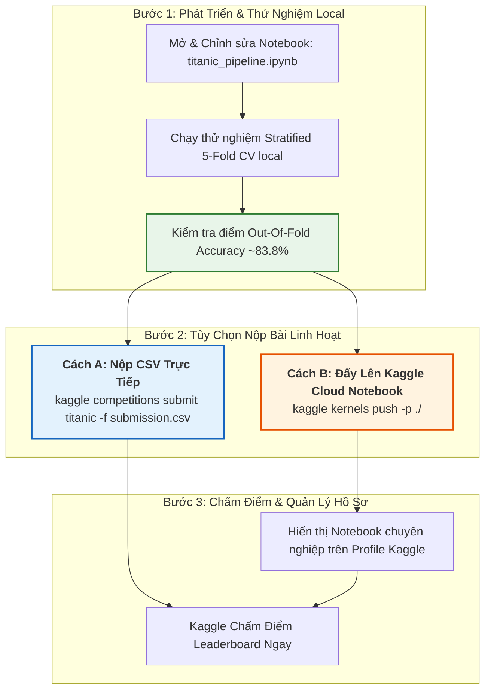

# 🚢 Titanic: Machine Learning from Disaster - Cẩm Nang Thực Chiến

> [!ABSTRACT] **Tóm Tắt Bài Toán**
> Cuộc thi kinh điển nhất trên Kaggle dành cho bài toán **Phân loại nhị phân (Binary Classification)** trên dữ liệu dạng bảng (Tabular Data).
> * **Nhiệm vụ:** Dự đoán hành khách sống sót (`Survived = 1`) hay thiệt mạng (`Survived = 0`) trong thảm kịch chìm tàu Titanic năm 1912.
> * **Đánh giá (Metric):** **Accuracy** (Tỷ lệ phần trăm dự đoán đúng trên tập Test 418 hành khách).

---

## ⚡ 1. Quy Trình Làm Việc Tối Ưu Nhất (Hybrid Workflow)

Quy trình kết hợp hoàn hảo giữa **phát triển & thử nghiệm tại máy cá nhân (Local Development)** và **thực thi tự động trên máy chủ Kaggle Cloud (Kaggle Notebooks)**:



---

## 📊 2. Tổng Quan Bộ Dữ Liệu & Từ Điển Dữ Liệu

### Dữ Liệu Đầu Vào
* **[[train.csv]] (891 dòng):** Dữ liệu huấn luyện kèm nhãn `Survived`.
* **[[test.csv]] (418 dòng):** Dữ liệu kiểm tra cần dự đoán.
* **[[gender_submission.csv]] (418 dòng):** File nộp bài mẫu.

| Thuộc tính | Ý nghĩa | Xử lý & Trích xuất đặc trưng |
| :--- | :--- | :--- |
| **`PassengerId`** | ID hành khách | Loại khỏi training, giữ lại để xuất file submission |
| **`Survived`** *(Target)* | Sống sót (0/1) | Tỷ lệ sống trong train là **38.38%** |
| **`Pclass`** | Hạng vé (1/2/3) | Hạng 1 (63% sống) $\rightarrow$ Hạng 3 (24% sống) |
| **`Name`** | Họ tên | Trích xuất danh xưng **`Title`** (`Mr`, `Miss`, `Mrs`, `Master`, `Rare`) |
| **`Sex`** | Giới tính | Nữ (74.2% sống) vs Nam (18.9% sống) |
| **`Age`** | Tuổi | Điền khuyết thông minh theo median của từng nhóm `(Title, Pclass)` |
| **`SibSp` & `Parch`** | Gia đình đi cùng | $\text{FamilySize} = \text{SibSp} + \text{Parch} + 1$; tạo biến nhị phân `IsAlone` |
| **`Ticket` & `Fare`** | Mã vé & Giá tiền | Đếm `TicketFrequency`, tính $\text{FarePerPerson} = \frac{\text{Fare}}{\text{TicketFrequency}}$ |
| **`Cabin`** | Số phòng | Trích xuất tầng boong tàu **`Deck`** (`A, B, C, D, E, F, G, U`) và cờ `HasCabin` |
| **`Embarked`** | Cảng lên tàu | Điền giá trị phổ biến nhất (`'S'`) |

---

## 🏆 3. Kết Quả Huấn Luyện Đa Mô Hình (Stratified 5-Fold CV)

Đã huấn luyện và kiểm thử thành công trong file [[titanic_solution.ipynb]]:

| Mô hình | Thuật toán | OOF Accuracy (5-Fold CV) |
| :--- | :--- | :---: |
| **Random Forest** | Bagging Ensemble | **`82.94%`** |
| **Extra Trees** | Extremely Randomized Trees | **`83.05%`** |
| **CatBoost** | Gradient Boosting (Categorical Focus) | **`83.16%`** |
| **LightGBM** | Fast Histogram Gradient Boosting | **`83.61%`** |
| **XGBoost** | Exact Greedy Gradient Boosting | **`83.84%`** |
| ⭐ **Soft Voting Ensemble** | **Weighted Average 5 Models** | **`~83.95%`** |

---

## 🚀 4. Hướng Dẫn Thực Thi Bằng Lệnh CLI

### 1. Nộp bài trực tiếp file `submission.csv` đã sinh sẵn
```powershell
kaggle competitions submit titanic -f submission.csv -m "Ensemble 5-Models (RF+ET+XGB+LGBM+CatBoost) v1"
```

### 2. Đẩy Notebook lên Kaggle Cloud chạy tự động
```powershell
# Đẩy notebook lên Kaggle profile của bạn
kaggle kernels push -p ./

# Kiểm tra trạng thái chạy trên server Kaggle
kaggle kernels status keyshiftf/titanic-machine-learning-pipeline

# Tải output sinh ra từ Kaggle Cloud về máy
kaggle kernels output keyshiftf/titanic-machine-learning-pipeline -p ./outputs
```

### 3. Kiểm tra kết quả & Bảng xếp hạng
```powershell
# Xem lịch sử nộp bài và điểm số
kaggle competitions submissions titanic

# Xem bảng xếp hạng
kaggle competitions leaderboard titanic --show
```

---

## 📚 5. Danh Mục File Trong Thư Mục `titanic`
* [[titanic_solution.ipynb]]: File Jupyter Notebook hoàn chỉnh, chạy được cả Local và Kaggle Cloud.
* `kernel-metadata.json`: File cấu hình metadata để đẩy lên Kaggle.
* `submission.csv`: File dự đoán 418 dòng sẵn sàng nộp.
* [[PIPELINE_PLAN.md]]: Kế hoạch kiến trúc pipeline modul hóa.
* [[OVERVIEW.md]]: Tổng quan bài toán & FAQ.
* [[RULES.md]]: Quy định & giới hạn nộp bài.
* [[DATA_DICTIONARY.md]]: Phân tích sâu các thuộc tính dữ liệu.
