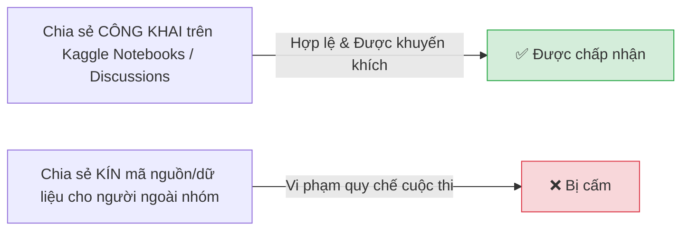

# ⚖️ Titanic: Machine Learning from Disaster - Quy Định & Luật Thi Đấu (Rules)

> [!IMPORTANT] **Tôn Trọng Tinh Thần Học Tập & Liêm Chính Học Thuật**
> Mục tiêu lớn nhất của cuộc thi Titanic là rèn luyện tư duy Khoa học Dữ liệu và kỹ năng Machine Learning. Mọi hành vi gian lận (như tra cứu danh sách sống sót thực tế lịch sử để nộp 100% Accuracy) đều đi ngược lại tinh thần của cuộc thi.

---

## 1. Quy Định Về Tài Khoản & Tham Gia (Accounts & Teams)

### 👤 Một tài khoản cho mỗi cá nhân (One Account Rule)
* Mỗi người tham gia chỉ được sử dụng **duy nhất 01 tài khoản Kaggle**.
* Nghiêm cấm tạo nhiều tài khoản (clone/multiple accounts) để nộp bài hoặc vượt quá giới hạn nộp bài hàng ngày.

### 👥 Làm việc nhóm (Team Size & Mergers)
* Bạn có thể thi đấu cá nhân (Solo) hoặc thành lập đội nhóm (Team).
* Số lượng thành viên tối đa trong một đội thông thường là **không quá giới hạn cho phép của cuộc thi (thường là 5 thành viên)**.
* Việc sáp nhập nhóm (Team Merger) chỉ được phép nếu tổng số lượt nộp của cả 2 nhóm không vượt quá giới hạn tích lũy tối đa.

---

## 2. Quy Định Về Chia Sẻ Dữ Liệu & Mã Nguồn (Code Sharing)

* **Chia sẻ công khai (Public Sharing):** Bạn được tự do chia sẻ ý tưởng, code, notebook và thảo luận trên diễn đàn chung của cuộc thi để cộng đồng cùng học hỏi.
* **Nghiêm cấm chia sẻ riêng tư ngoài nhóm (No Private Sharing):** Không được chia sẻ code, mô hình, hoặc dữ liệu dự đoán riêng tư cho các đối thủ hoặc thành viên không thuộc nhóm của bạn.

---

## 3. Giới Hạn Nộp Bài (Submission Limits)

| Quy định | Giới hạn |
| :--- | :--- |
| **Số lần nộp tối đa trong ngày** | **10 lần / ngày** (10 submissions per day) |
| **Thời gian reset giới hạn** | 00:00:00 UTC hàng ngày |
| **Chọn bài nộp chung cuộc** | Được chọn tối đa **2 bài nộp** để tính điểm Private Leaderboard |

---

## 4. Dữ Liệu Bên Ngoài (External Data) & Liêm Chính Dữ Liệu

> [!WARNING] **Tránh Gian Lận Tra Cứu Sự Thật Lịch Sử (Ground Truth Leaking)**
> * Danh sách toàn bộ 2,224 nạn nhân và người sống sót của thảm kịch Titanic có sẵn trên Internet (ví dụ: Wikipedia, Encyclopedia Titanica).
> * **Không được phép** dùng danh sách này để hard-code nhãn `Survived` nhằm đạt điểm số $1.00000$ (100%) ảo trên bảng xếp hạng.
> * Việc đạt 100% bằng cách gian lận dữ liệu không mang lại giá trị học tập và sẽ bị cộng đồng Kaggle coi là spam.

---

## 5. Bản Quyền & Giấy Phép Sử Dụng
* Dữ liệu được cung cấp phục vụ mục đích nghiên cứu và giáo dục.
* Mã nguồn bạn chia sẻ trên Kaggle mặc định tuân theo giấy phép mã nguồn mở (Open Source License: Apache 2.0 / MIT).
